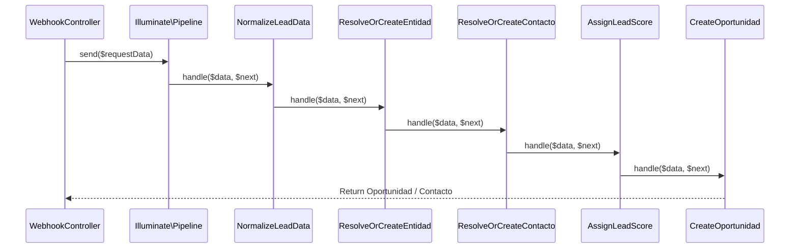

# Technical Design: Multi-Pipeline Support & Lead Ingestion Pipeline

## 1. Database Schema Updates

### Decision: Enum to Varchar transition for Oportunidad State
Para soportar múltiples pipelines con diferentes conjuntos de estados, la columna `estado` en la tabla `oportunidad` se convertirá de `ENUM` a `VARCHAR(50)`. La validación de los estados válidos según el pipeline se resolverá a nivel de aplicación (en el modelo `Oportunidad` o mediante un request class), permitiendo una flexibilidad extrema sin necesidad de alterar la base de datos para futuros flujos.

Se agregará además la columna `pipeline` a la tabla `oportunidad` y la columna `score` a la tabla `contacto`.

### Migration Plan
- Crear una migración en `database/migrations/` que:
  1. Agregue `score` (integer, default 0, nullable) a la tabla `contacto`.
  2. Agregue `pipeline` (string, default 'Llegada') a la tabla `oportunidad`.
  3. Modifique la columna `estado` en la tabla `oportunidad` para cambiar su tipo de `ENUM` a `VARCHAR(50)`.

---

## 2. Model Layer and Validation Rules

### Oportunidad Model (`Modules/CRM/app/Models/Oportunidad.php`)
Se implementará una constante con la definición de los pipelines y sus respectivos estados permitidos:

```php
const PIPELINES = [
    'Llegada' => ['Borrador', 'Enviada', 'Aceptada', 'Rechazada', 'Ganada', 'Perdida'],
    'Rescate' => ['Rescate_Inicial', 'Rescate_En_Progreso', 'Rescate_Exitoso', 'Rescate_Fallido']
];
```

Se agregará un método de validación o un hook de modelo (`booting` / `saving`) que verifique que el estado asignado sea válido para el pipeline configurado.

---

## 3. Lead Ingestion Pipeline Architecture

Se implementará el patrón Pipeline mediante la clase nativa `Illuminate\Pipeline\Pipeline`.

### Class Diagram / Sequence Flow



---

## 4. Class Specifications

### Ingestion Action (`Modules/CRM/app/Actions/IngestLeadAction.php`)
Clase orquestadora para invocar el pipeline.

```php
namespace Modules\CRM\Actions;

use Illuminate\Pipeline\Pipeline;
use Illuminate\Support\Facades\DB;

class IngestLeadAction
{
    public function execute(array $data)
    {
        return DB::transaction(function () use ($data) {
            return app(Pipeline::class)
                ->send($data)
                ->through([
                    \Modules\CRM\Pipelines\IngestLead\NormalizeLeadData::class,
                    \Modules\CRM\Pipelines\IngestLead\ResolveOrCreateEntidad::class,
                    \Modules\CRM\Pipelines\IngestLead\ResolveOrCreateContacto::class,
                    \Modules\CRM\Pipelines\IngestLead\AssignLeadScore::class,
                    \Modules\CRM\Pipelines\IngestLead\CreateOportunidad::class,
                ])
                ->then(function ($passable) {
                    return $passable['oportunidad'];
                });
        });
    }
}
```
