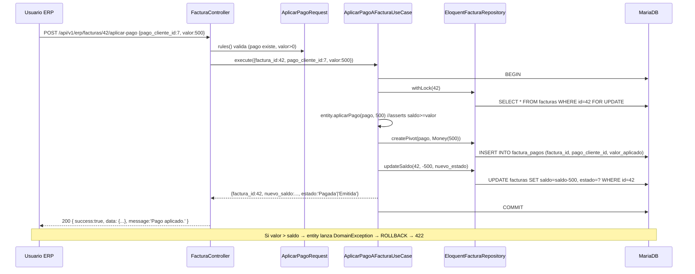
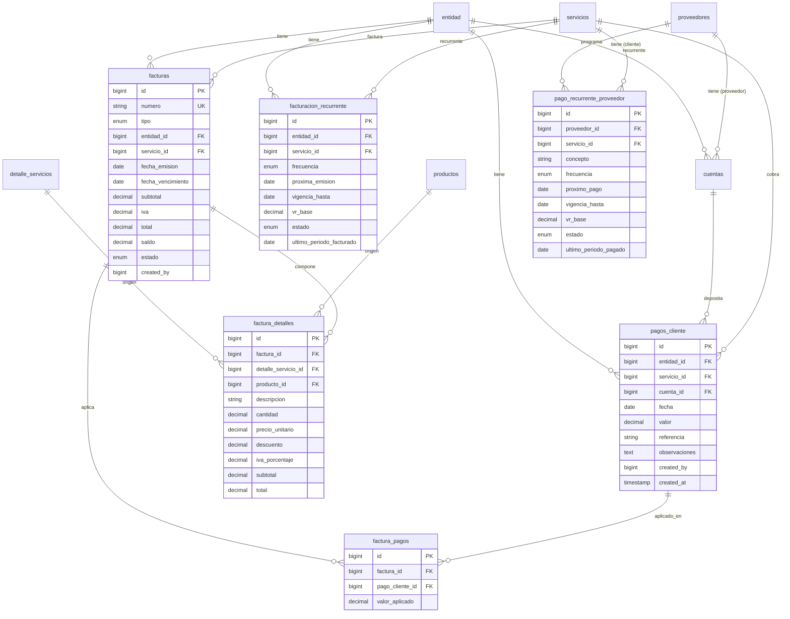

# Design: AFIN-001 — Módulo Administrativo-Financiero (Minerva)

| Field | Value |
|-------|-------|
| **Status** | Draft |
| **Date** | 2026-08-19 |
| **Related** | `Docs/design/ADD-AFIN-001-modulo-administrativo-financiero.md`, `Docs/changes/AFIN-001-modulo-administrativo-financiero/proposal.md` |
| **Sprint** | Sprint 1 (2 semanas, 1 dev full-stack) |
| **Capabilities** | 7 — `erp-banking-accounts`, `erp-cxc-payments`, `erp-invoicing`, `erp-cartera-report`, `erp-cxp-report`, `erp-recurring-scheduler`, `erp-rbac-middleware` |

> This document is the **"how"**. The **"why"** lives in the proposal and the **"which attributes"** live in the ADD. Mapping: §1–§2 architecture, §3–§7 implementation layers, §8 data, §9 runtime behavior, §10–§13 cross-cutting.

---

## 1. Module & Directory Layout

### 1.1 Source of truth (decision)

**Decision**: New ERP code lives entirely in `app/` root (Clean Architecture). The `Modules/Administrativo` directory remains as the *current* shadow-model home (`App\Models\Cuenta` extends `Modules\Administrativo\Models\Cuenta`), but **no new ERP code is added there**. New entities (Factura, PagoCliente, FacturacionRecurrente, PagoRecurrenteProveedor, FacturaDetalle, FacturaPago) ship as Eloquent models in `app/Models/` inheriting `BaseModel`. ADR-002 captures the longer-term plan to migrate the rest of `Modules/Administrativo` to a single source.

**Rationale**: Two sources of truth for the same entity class is debt. Tareas A1 (limpiar shadow models) ya está en el plan del sprint; los modelos nuevos **no se replican** en el módulo — solo existen en `app/Models/`.

### 1.2 Directory tree (new + modified)

```
app/
├── Application/UseCases/ERP/
│   ├── Cuenta/{StoreCuentaUseCase,UpdateCuentaUseCase,DestroyCuentaUseCase}.php
│   ├── PagoCliente/{StorePagoClienteUseCase,ListPagosClienteUseCase}.php
│   ├── Factura/
│   │   ├── StoreFacturaUseCase.php
│   │   ├── UpdateFacturaUseCase.php
│   │   ├── ConvertirProformaAFacturaUseCase.php
│   │   └── AplicarPagoAFacturaUseCase.php
│   ├── Reporte/{CarteraReporteUseCase,PagosReporteUseCase}.php
│   └── Recurrente/
│       ├── {Store,Update,Pausar,Reanudar}RecurrenteUseCase.php
│       └── GenerarFacturasRecurrentesUseCase.php   ← invocado por el command
├── Domain/Entities/{Cuenta,Factura,FacturaDetalle,FacturaPago,PagoCliente,FacturacionRecurrente,PagoRecurrenteProveedor}.php
├── Domain/Repositories/
│   ├── FacturaRepositoryInterface.php
│   ├── PagoClienteRepositoryInterface.php
│   ├── FacturacionRecurrenteRepositoryInterface.php
│   └── PagoRecurrenteProveedorRepositoryInterface.php
│   (CuentaRepositoryInterface ya existe — se modifica firma)
├── Http/Controllers/ERP/
│   ├── {Cuenta,PagoCliente,Factura,FacturacionRecurrente,PagoRecurrenteProveedor}Controller.php
│   ├── ReporteCarteraController.php
│   └── ReportePagosController.php
├── Http/Requests/ERP/{Cuenta,PagoCliente,Factura,FacturacionRecurrente,PagoRecurrenteProveedor}Request.php
├── Http/Resources/ERP/{Cuenta,PagoCliente,Factura,FacturaDetalle,Recurrente}Resource.php
├── Infrastructure/Auth/ErpAuthMiddleware.php                    ← NEW
├── Infrastructure/Persistence/
│   ├── EloquentFacturaRepository.php
│   ├── EloquentPagoClienteRepository.php
│   ├── EloquentFacturacionRecurrenteRepository.php
│   └── EloquentPagoRecurrenteProveedorRepository.php
├── Console/Commands/FinancieroGenerarFacturasRecurrentesCommand.php   ← NEW
└── Models/{Factura,FacturaDetalle,FacturaPago,PagoCliente,FacturacionRecurrente,PagoRecurrenteProveedor}.php

database/migrations/
├── 2026_08_19_100000_add_entidad_id_and_tipo_cuenta_to_cuentas_table.php
├── 2026_08_19_100001_modify_frecuencia_to_enum_on_oportunidad_table.php
├── 2026_08_19_100002_create_pagos_cliente_table.php
├── 2026_08_19_100003_create_facturas_table.php
├── 2026_08_19_100004_create_factura_detalles_table.php
├── 2026_08_19_100005_create_factura_pagos_table.php
├── 2026_08_19_100006_create_facturacion_recurrente_table.php
└── 2026_08_19_100007_create_pago_recurrente_proveedor_table.php

Modified:
├── routes/api.php                       ← +bloque Route::prefix('erp') con erp.auth
├── routes/console.php                   ← +Schedule::command('financiero:generar-facturas-recurrentes')
├── bootstrap/app.php                    ← +alias 'erp.auth' => ErpAuthMiddleware::class
├── app/Models/Cuenta.php                 ← ya es wrapper; sin cambio (hereda del módulo)
└── app/Models/Movimiento.php            ← ya es wrapper; sin cambio
```

---

## 2. Domain Model (DDD entities + value objects)

> All entities live in `App\Domain\Entities\*` as **pure PHP** (no Eloquent dependencies inside invariants). Eloquent responsibilities stay in `app/Models/*` via the `BaseModel` infrastructure trait. Use cases convert between entity ↔ model when persisting.

### 2.1 Entity: `Cuenta` (modifies existing — discriminator)

```php
final class Cuenta {
    public function __construct(
        public ?int $id,
        public string $banco,                  // nullable futuro
        public string $numero,
        public string $tipo,                   // 'Ahorros'|'Corriente' (existente)
        public TipoCuenta $tipoCuenta,         // NEW ENUM: 'proveedor'|'cliente'
        public ?int $proveedorId,
        public ?int $entidadId,
        public int $createdBy,
    ) {}

    public function assert(): void {
        if ($this->tipoCuenta === TipoCuenta::Proveedor && ($this->proveedorId === null || $this->entidadId !== null)) {
            throw new InvalidCuentaException('Cuenta de proveedor debe tener proveedor_id y NO entidad_id.');
        }
        if ($this->tipoCuenta === TipoCuenta::Cliente && ($this->entidadId === null || $this->proveedorId !== null)) {
            throw new InvalidCuentaException('Cuenta de cliente debe tener entidad_id y NO proveedor_id.');
        }
    }
}
```

**Invariant**: exactly-one-of `proveedorId`/`entidadId`. Reflejado en CHECK constraint a nivel DB (defense in depth) y en app layer.

### 2.2 Entity: `Factura` (new)

```php
final class Factura {
    public function __construct(
        public ?int $id,
        public string $numero,                  // UNIQUE, asignado al convertir
        public TipoFactura $tipo,               // 'proforma'|'factura'
        public int $entidadId,
        public ?int $servicioId,
        public Carbon $fechaEmision,
        public ?Carbon $fechaVencimiento,
        public Money $subtotal,
        public Money $iva,
        public Money $total,
        public Money $saldo,
        public EstadoFactura $estado,           // 'Borrador'|'Emitida'|'Pagada'|'Anulada'
        public ?string $observaciones,
        public array $detalles = [],            // FacturaDetalle[]
        public array $pagos = [],               // FacturaPago[]
    ) {}

    public function addDetalle(FacturaDetalle $d): void { ... recalcula subtotal/iva/total/saldo ... }

    public function aplicarPago(PagoCliente $pago, Money $valor): void {
        if ($this->estado === EstadoFactura::Anulada) throw new DomainException('No se pueden aplicar pagos a factura anulada.');
        if ($this->estado === EstadoFactura::Borrador) throw new DomainException('Factura en borrador no acepta pagos.');
        if ($valor->greaterThan($this->saldo)) throw new DomainException('El valor aplicado supera el saldo.');
        $this->saldo = $this->saldo->subtract($valor);
        $this->pagos[] = new FacturaPago(null, $this->id, $pago->id, $valor);
        if ($this->saldo->isZero()) $this->estado = EstadoFactura::Pagada;
    }

    public function convertir(): void {
        if ($this->tipo === TipoFactura::Factura) throw new DomainException('Ya es factura.');
        if ($this->estado !== EstadoFactura::Borrador && $this->estado !== EstadoFactura::Emitida) throw new DomainException('Estado no permite conversión.');
        $this->tipo = TipoFactura::Factura;
        $this->numero = $this->generarNumero();   // estrategia: prefijo FAC-{secuencial}-{yyyy}
    }
}
```

**Invariants**:
- `tipo ∈ {proforma, factura}` — discriminador.
- `saldo ≥ 0` y `saldo ≤ total` (recalculado post-aplicarPago).
- Estados terminal: `Anulada` no permite aplicar pago.
- Conversión `proforma → factura` solo en estados `Borrador` o `Emitida`.

### 2.3 Entity: `PagoCliente` (new)

```php
final class PagoCliente {
    public function __construct(
        public ?int $id,
        public int $entidadId,
        public ?int $servicioId,
        public ?int $cuentaId,
        public Carbon $fecha,
        public Money $valor,
        public ?string $referencia,
        public ?string $observaciones,
    ) {
        if ($valor->isZeroOrNegative()) throw new DomainException('El valor del pago debe ser positivo.');
    }

    /** Saldo disponible = valor - Σ(valor_aplicado) en factura_pagos. */
    public function saldoDisponible(): Money { /* consulta al repo */ }
}
```

**Invariant**: `valor > 0`. Se valida en constructor.

### 2.4 Entity: `FacturacionRecurrente` (new)

```php
final class FacturacionRecurrente {
    public function __construct(
        public ?int $id,
        public int $entidadId,
        public ?int $servicioId,
        public Frecuencia $frecuencia,          // 'mensual'|'trimestral'|'semestral'|'anual'
        public Carbon $proximaEmision,
        public ?Carbon $vigenciaHasta,
        public Money $vrBase,
        public EstadoRecurrente $estado,        // 'Activa'|'Pausada'|'Cancelada'
        public ?Carbon $ultimoPeriodoFacturado,
    ) {}

    public function assert(): void {
        if ($this->vigenciaHasta && $this->proximaEmision->greaterThan($this->vigenciaHasta)) {
            throw new DomainException('proxima_emision no puede ser mayor que vigencia_hasta.');
        }
    }

    public function avanzarProximaEmision(Carbon $hoy): void {
        $this->ultimoPeriodoFacturado = $hoy;
        $this->proximaEmision = match ($this->frecuencia) {
            Frecuencia::Mensual    => $this->proximaEmision->addMonth(),
            Frecuencia::Trimestral => $this->proximaEmision->addMonths(3),
            Frecuencia::Semestral  => $this->proximaEmision->addMonths(6),
            Frecuencia::Anual      => $this->proximaEmision->addYear(),
        };
        if ($this->vigenciaHasta && $this->proximaEmision->greaterThan($this->vigenciaHasta)) {
            $this->estado = EstadoRecurrente::Pausada;
        }
    }

    public function pausar(): void  { $this->estado = EstadoRecurrente::Pausada; }
    public function reanudar(): void { $this->estado = EstadoRecurrente::Activa; }
    public function cancelar(): void { $this->estado = EstadoRecurrente::Cancelada; }
}
```

### 2.5 Entity: `PagoRecurrenteProveedor` (new)

Misma forma que §2.4 con semántica de egreso (CxP). Campos: `proveedorId`, `concepto`, `frecuencia`, `proximoPago`, `vigenciaHasta`, `vrBase`, `estado`, `ultimoPeriodoPagado`. Método `avanzarProximoPago()` análogo.

### 2.6 Value objects auxiliares

- `App\Domain\ValueObjects\Money` — decimal(15,2) inmutable, operaciones `add/subtract/greaterThan/isZero/isZeroOrNegative/format(currency='COP')`.
- `App\Domain\Enums\{TipoCuenta, TipoFactura, EstadoFactura, Frecuencia, EstadoRecurrente}` — PHP 8.1 enums.

---

## 3. Persistence Layer (Repository pattern)

For every new entity: interface in `app/Domain/Repositories/*RepositoryInterface.php`, Eloquent implementation in `app/Infrastructure/Persistence/Eloquent*Repository.php`. Bindings in `app/Providers/AppServiceProvider.php`.

| Repository interface | Eloquent impl | Key methods |
|---|---|---|
| `FacturaRepositoryInterface` | `EloquentFacturaRepository` | `find($id)`, `findByNumero($numero)`, `paginateForCartera($filters)`, `withLock($id)` (SELECT … FOR UPDATE), `createWithDetalles(array)`, `updateSaldo($id, Money $delta, string $estado)`, `createPivot(PagoCliente, Money)` |
| `PagoClienteRepositoryInterface` | `EloquentPagoClienteRepository` | `find($id)`, `paginate($filters)`, `saldoDisponible($id): Money` |
| `FacturacionRecurrenteRepositoryInterface` | `EloquentFacturacionRecurrenteRepository` | `dueAsOf(Carbon $fecha): Collection` (filtra `estado='Activa'` AND `proxima_emision <= $fecha`), `advance($id, Carbon $hoy)` |
| `PagoRecurrenteProveedorRepositoryInterface` | `EloquentPagoRecurrenteProveedorRepository` | simétrico |
| `CuentaRepositoryInterface` *(exists)* | Eloquent *(exists)* | agregar `create(array)` con assert de `tipo_cuenta` en app layer antes de delegar al modelo |

**AppServiceProvider additions**:
```php
$this->app->bind(FacturaRepositoryInterface::class, EloquentFacturaRepository::class);
$this->app->bind(PagoClienteRepositoryInterface::class, EloquentPagoClienteRepository::class);
$this->app->bind(FacturacionRecurrenteRepositoryInterface::class, EloquentFacturacionRecurrenteRepository::class);
$this->app->bind(PagoRecurrenteProveedorRepositoryInterface::class, EloquentPagoRecurrenteProveedorRepository::class);
```

---

## 4. Application Layer (Use Cases)

Cada caso de uso = clase única. Constructor con `RepositoryInterface`s (sin Facades). No debe inyectar `Request`.

### 4.1 Use cases — `Cuenta`

| Use case | Path | Input DTO | Output | Errors |
|---|---|---|---|---|
| `StoreCuentaUseCase` | `ERP/Cuenta/StoreCuentaUseCase.php` | `{banco, numero, tipo, tipo_cuenta, proveedor_id?, entidad_id?, created_by}` | `Cuenta` entity | `InvalidCuentaException` (400/422) si no pasa `assert()` |
| `UpdateCuentaUseCase` | `ERP/Cuenta/UpdateCuentaUseCase.php` | `{id, ...campos editables}` | `Cuenta` | `ModelNotFoundException → 404` |
| `DestroyCuentaUseCase` | `ERP/Cuenta/DestroyCuentaUseCase.php` | `{id}` | `bool` | `QueryException` SQLSTATE 23000 → 422 (mapeado en `bootstrap/app.php`) |

### 4.2 Use cases — `PagoCliente`

| Use case | Path | Input | Output | Side effects |
|---|---|---|---|---|
| `StorePagoClienteUseCase` | `ERP/PagoCliente/StorePagoClienteUseCase.php` | `{entidad_id, servicio_id?, cuenta_id?, fecha, valor, referencia?, observaciones?, created_by}` | `PagoCliente` | — |
| `ListPagosClienteUseCase` | `ERP/PagoCliente/ListPagosClienteUseCase.php` | `{filters, page, perPage}` | `LengthAwarePaginator` | read-only |

### 4.3 Use cases — `Factura`

| Use case | Path | Input | Output | Side effects |
|---|---|---|---|---|
| `StoreFacturaUseCase` | `ERP/Factura/StoreFacturaUseCase.php` | `{entidad_id, servicio_id?, fecha_emision, fecha_vencimiento?, detalles:[{descripcion, cantidad, precio_unitario, descuento, iva_porcentaje}], created_by}` | `Factura` | `DB::transaction`: 1 INSERT en `facturas` + N INSERT en `factura_detalles`. Recalcula totales. |
| `UpdateFacturaUseCase` | `ERP/Factura/UpdateFacturaUseCase.php` | `{id, ...editables}` | `Factura` | Solo permitido si `estado = 'Borrador'`. |
| `ConvertirProformaAFacturaUseCase` | `ERP/Factura/ConvertirProformaAFacturaUseCase.php` | `{id}` | `Factura` | `DB::transaction`: `SELECT … FOR UPDATE` + `UPDATE tipo='factura', numero=NEXT_NUM()`. Dispara evento `FacturaConvertida`. |
| `AplicarPagoAFacturaUseCase` | `ERP/Factura/AplicarPagoAFacturaUseCase.php` | `{factura_id, pago_cliente_id, valor}` | `{factura_id, nuevo_saldo, estado}` | `DB::transaction`: `SELECT factura FOR UPDATE`, INSERT en `factura_pagos`, UPDATE saldo, IF saldo=0 → estado='Pagada'. Dispara `PagoAplicado`. |

### 4.4 Use cases — `Reporte`

| Use case | Path | Input | Output | Notas |
|---|---|---|---|---|
| `CarteraReporteUseCase` | `ERP/Reporte/CarteraReporteUseCase.php` | `{entidad_id?, aging_buckets:true, page, perPage}` | `LengthAwarePaginator<{factura, entidad, dias_mora, bucket}>` | Strategy para aging (0-30/31-60/61-90/90+). Cache 5min. |
| `PagosReporteUseCase` | `ERP/Reporte/PagosReporteUseCase.php` | `{proveedor_id?, fecha_desde?, fecha_hasta?, page, perPage}` | `LengthAwarePaginator<{pago, proveedor, cuenta_origen}>` | Lee de `movimientos` (sin refactorizar). Cache 5min. |

### 4.5 Use cases / commands — `Recurrente`

| Use case / command | Path | Trigger | Side effects |
|---|---|---|---|
| `StoreFacturacionRecurrenteUseCase` | `ERP/Recurrente/StoreFacturacionRecurrenteUseCase.php` | HTTP POST | — |
| `UpdateFacturacionRecurrenteUseCase` | `ERP/Recurrente/UpdateFacturacionRecurrenteUseCase.php` | HTTP PUT | — |
| `PausarRecurrenteUseCase` / `ReanudarRecurrenteUseCase` | `ERP/Recurrente/PausarRecurrenteUseCase.php` | HTTP POST `/{id}/pausar` | cambia estado |
| `GenerarFacturasRecurrentesUseCase` | `ERP/Recurrente/GenerarFacturasRecurrentesUseCase.php` | command `financiero:generar-facturas-recurrentes` | `DB::transaction` por cada recurrente vencida: crea Factura proforma + detalles + UPDATE `ultimo_periodo_facturado` + avanza `proxima_emision`. Si pasa `vigencia_hasta` → `Pausada`. Emite `RecurrenciaGenerada`. |

**Equivalentes simétricos** para `PagoRecurrenteProveedor` (Store / Update / Pausar / Generar command). Solo difiere en que crea `movimientos` (egreso), no factura.

### 4.6 Side-effect conventions

- **Eventos de dominio** (preparados para futuro, sin listeners en sprint 1): `PagoAplicado`, `FacturaConvertida`, `RecurrenciaGenerada`, `CarteraConsultada`. Usar `event(new ...)`.
- **Transacciones**: `DB::transaction(fn() => ...)` cuando se toca >1 tabla. **Nunca** dentro del controller.

---

## 5. HTTP Layer (Controllers + Requests + Resources)

### 5.1 Route registration (extensión de `routes/api.php`)

```php
Route::prefix('v1/erp')->middleware(['auth:sanctum', 'throttle-mutations', 'erp.auth'])->group(function () {
    // Cuentas cliente/proveedor — HU03
    Route::apiResource('cuentas', \App\Http\Controllers\ERP\CuentaController::class);

    // Pagos recibidos de clientes (CxC) — HU05
    Route::apiResource('pagos-cliente', \App\Http\Controllers\ERP\PagoClienteController::class)->only(['index', 'store', 'show']);

    // Facturas (pro-forma + factura) — HU08
    Route::apiResource('facturas', \App\Http\Controllers\ERP\FacturaController::class);
    Route::post('facturas/{id}/convertir', [\App\Http\Controllers\ERP\FacturaController::class, 'convertirProforma'])
        ->name('erp.facturas.convertir');
    Route::post('facturas/{id}/aplicar-pago', [\App\Http\Controllers\ERP\FacturaController::class, 'aplicarPago'])
        ->name('erp.facturas.aplicar-pago');

    // Reportes — HU06 / HU07
    Route::get('cartera', [\App\Http\Controllers\ERP\ReporteCarteraController::class, 'index'])
        ->name('erp.cartera')->withoutMiddleware('throttle-mutations');
    Route::get('pagos',  [\App\Http\Controllers\ERP\ReportePagosController::class, 'index'])
        ->name('erp.pagos')->withoutMiddleware('throttle-mutations');

    // Recurrencia cliente — HU09
    Route::apiResource('facturacion-recurrente', \App\Http\Controllers\ERP\FacturacionRecurrenteController::class);
    Route::post('facturacion-recurrente/{id}/pausar',   [\App\Http\Controllers\ERP\FacturacionRecurrenteController::class, 'pausar'])->name('erp.recurrente.cliente.pausar');
    Route::post('facturacion-recurrente/{id}/reanudar', [\App\Http\Controllers\ERP\FacturacionRecurrenteController::class, 'reanudar'])->name('erp.recurrente.cliente.reanudar');

    // Recurrencia proveedor — HU10
    Route::apiResource('pagos-recurrentes', \App\Http\Controllers\ERP\PagoRecurrenteProveedorController::class);
});
```

### 5.2 Controllers — patrón thin

```php
class FacturaController extends Controller {
    use ApiResponse;
    public function __construct(
        private StoreFacturaUseCase $store,
        private UpdateFacturaUseCase $update,
        private AplicarPagoAFacturaUseCase $aplicar,
        private ConvertirProformaAFacturaUseCase $convertir,
    ) {}

    public function store(StoreFacturaRequest $r): JsonResponse {
        $factura = $this->store->execute($r->validated());
        return $this->successResponse(FacturaResource::make($factura), 201, 'Factura creada.');
    }

    public function aplicarPago(int $id, AplicarPagoRequest $r): JsonResponse {
        $result = $this->aplicar->execute([
            'factura_id'      => $id,
            'pago_cliente_id' => $r->input('pago_cliente_id'),
            'valor'           => $r->input('valor'),
        ]);
        return $this->successResponse($result, 200, 'Pago aplicado.');
    }
}
```

### 5.3 Form Requests (validation)

| Request | Rules clave |
|---|---|
| `ERP\CuentaRequest` (Store/Update) | `banco:string\|max:80`, `numero:string\|max:50`, `tipo:in:Ahorros,Corriente`, `tipo_cuenta:in:proveedor,cliente`, `proveedor_id:required_if:tipo_cuenta,proveedor\|nullable\|exists:proveedores,id`, `entidad_id:required_if:tipo_cuenta,cliente\|nullable\|exists:entidad,id` (custom rule `xor:proveedor_id,entidad_id`) |
| `ERP\PagoClienteRequest` | `entidad_id:required\|exists:entidad,id`, `fecha:required\|date`, `valor:required\|numeric\|min:0.01`, `cuenta_id:nullable\|exists:cuentas,id`, `servicio_id:nullable\|exists:servicios,id` |
| `ERP\StoreFacturaRequest` | `entidad_id:required\|exists:entidad,id`, `fecha_emision:required\|date`, `fecha_vencimiento:nullable\|date\|after_or_equal:fecha_emision`, `detalles:required\|array\|min:1`, `detalles.*.descripcion:required\|string\|max:255`, `detalles.*.cantidad:required\|numeric\|min:0.01`, `detalles.*.precio_unitario:required\|numeric\|min:0`, `detalles.*.descuento:nullable\|numeric\|min:0\|max:100`, `detalles.*.iva_porcentaje:nullable\|numeric\|min:0\|max:100` |
| `ERP\AplicarPagoRequest` | `pago_cliente_id:required\|exists:pagos_cliente,id`, `valor:required\|numeric\|min:0.01` (cross-field vs saldo en use case) |
| `ERP\FacturacionRecurrenteRequest` | `entidad_id:required\|exists:entidad,id`, `frecuencia:in:mensual,trimestral,semestral,anual`, `proxima_emision:required\|date`, `vigencia_hasta:nullable\|date\|after_or_equal:proxima_emision`, `vr_base:required\|numeric\|min:0.01`, `servicio_id:nullable\|exists:servicios,id` |
| `ERP\PagoRecurrenteProveedorRequest` | simétrico con `proveedor_id` y `proximo_pago` |
| `ERP\ReporteCarteraRequest` | `entidad_id:nullable\|exists:entidad,id`, `page:integer\|min:1`, `per_page:integer\|min:1\|max:100` |
| `ERP\ReportePagosRequest` | `proveedor_id:nullable\|exists:proveedores,id`, `fecha_desde:nullable\|date`, `fecha_hasta:nullable\|date\|after_or_equal:fecha_desde`, `page`, `per_page` |

### 5.4 API Resources (response shape)

| Resource | Fields |
|---|---|
| `ERP\CuentaResource` | `id`, `banco`, `numero`, `tipo`, `tipo_cuenta`, `proveedor:id,nombre`, `entidad:id,nombre`, `created_at` |
| `ERP\PagoClienteResource` | `id`, `entidad:id,nombre`, `cuenta:id,banco,numero`, `fecha`, `valor`, `saldo_disponible` (computed), `referencia`, `observaciones`, `created_at` |
| `ERP\FacturaResource` | `id`, `numero`, `tipo`, `estado`, `entidad:id,nombre`, `servicio:id,nombre`, `fecha_emision`, `fecha_vencimiento`, `subtotal`, `iva`, `total`, `saldo`, `observaciones`, `detalles` (collection `FacturaDetalleResource`), `pagos` (collection anidada), `created_at` |
| `ERP\FacturaDetalleResource` | `id`, `descripcion`, `cantidad`, `precio_unitario`, `descuento`, `iva_porcentaje`, `subtotal`, `total` |
| `ERP\FacturacionRecurrenteResource` | `id`, `entidad:id,nombre`, `servicio:id,nombre`, `frecuencia`, `proxima_emision`, `vigencia_hasta`, `vr_base`, `estado`, `ultimo_periodo_facturado` |
| `ERP\PagoRecurrenteProveedorResource` | simétrico |

**Envelope**: usar `ApiResponse::successResponse()` de `App\Http\Controllers\API\Concerns\ApiResponse` (ya existente). Errores: `errorResponse(message, code)`.

---

## 6. Middleware: `ErpAuthMiddleware`

### 6.1 Implementación

```php
namespace App\Infrastructure\Auth;

use App\Http\Controllers\API\Concerns\ApiResponse;
use Closure;
use Illuminate\Http\Request;
use Symfony\Component\HttpFoundation\Response;

class ErpAuthMiddleware {
    public function handle(Request $request, Closure $next): Response {
        $user = $request->user();
        if (! $user) {
            return response()->json(['success' => false, 'error' => 'No autenticado.'], 401);
        }
        $allowed = array_map('intval', config('erp.allowed_rol_ids', [4, 5]));
        if (! in_array((int) $user->rol_id, $allowed, true)) {
            // Audit log de denegación
            \Log::channel('erp')->warning('erp.access_denied', [
                'user_id' => $user->id,
                'rol_id'  => $user->rol_id,
                'ip'      => $request->ip(),
                'path'    => $request->path(),
            ]);
            return response()->json(['success' => false, 'error' => 'Acceso ERP no autorizado para su rol.'], 403);
        }
        return $next($request);
    }
}
```

Registro en `bootstrap/app.php`:
```php
$middleware->alias([
    // ...existing...
    'erp.auth' => \App\Infrastructure\Auth\ErpAuthMiddleware::class,
]);
```

### 6.2 Configuración

```php
// config/erp.php (nuevo)
return [
    'allowed_rol_ids' => array_map('intval', explode(',', env('ERP_ALLOWED_ROL_IDS', '4,5'))),
    'log_channel'     => env('ERP_LOG_CHANNEL', 'erp'),
];
```

`.env` addition (no commit): `ERP_ALLOWED_ROL_IDS=4,5`

Capacidad cubierta: **`erp-rbac-middleware`**.

---

## 7. Scheduler: `FinancieroGenerarFacturasRecurrentesCommand`

### 7.1 Signature

```
php artisan financiero:generar-facturas-recurrentes [--dry-run] [--entidad-id=X] [--fecha=YYYY-MM-DD]
```

### 7.2 Algorithm (idempotente)

1. Resolver fecha objetivo (`$fecha = $fechaArg ?? today()`).
2. `Collection $candidatas = $repo->dueAsOf($fecha)` →
   `SELECT * FROM facturacion_recurrente WHERE estado='Activa' AND proxima_emision <= ? AND deleted_at IS NULL AND (vigencia_hasta IS NULL OR vigencia_hasta >= ?) FOR UPDATE SKIP LOCKED`.
3. Por cada candidato, dentro de `DB::transaction`:
   - `SELECT * FROM facturacion_recurrente WHERE id = ? FOR UPDATE` (defensivo si el driver no soporta SKIP LOCKED).
   - Saltar si `ultimo_periodo_facturado === $fecha` (idempotencia).
   - `StoreFacturaUseCase::execute(...)` con `tipo='proforma'`, `saldo=vrBase`, `estado='Emitida'`.
   - `UpdateFacturacionRecurrente` con `ultimo_periodo_facturado = $fecha`.
   - `entity->avanzarProximaEmision($fecha)` — persiste `proxima_emision` y, si pasa `vigencia_hasta`, `estado='Pausada'`.
4. Por cada factura generada emitir `event(new FacturaRecurrenteGenerada($factura))`.
5. `Log::info('erp.recurrente.generated', ['count' => N, 'fecha' => $fecha])`.

### 7.3 Concurrencia / idempotencia

- `withoutOverlapping()` evita dos runs concurrentes en el mismo host.
- `onOneServer()` evita runs en múltiples workers.
- `ultimo_periodo_facturado = $fecha` dedup defensivo: un re-run el mismo día no genera duplicados aunque el lock falle.
- Si la versión de MariaDB **no soporta** `SKIP LOCKED` (< 10.6) → fallback a `SELECT FOR UPDATE` simple (cola implícita). Documentar en ADR-002.

### 7.4 Schedule entry (`routes/console.php`)

```php
use Illuminate\Support\Facades\Schedule;

Schedule::command('financiero:generar-facturas-recurrentes')
    ->dailyAt('02:00')
    ->timezone('America/Bogota')
    ->withoutOverlapping(60)   // lock 60 min
    ->onOneServer()
    ->runInBackground()
    ->emailOutputOnFailure(env('OPS_ALERT_EMAIL'));
```

---

## 8. Database Migrations (ordering)

> Naming: `YYYY_MM_DD_HHMMSS_name.php`. Fecha base `2026_08_19`.

| # | File | Tipo | Dependencias | Notas |
|---|---|---|---|---|
| 1 | `2026_08_19_100000_add_entidad_id_and_tipo_cuenta_to_cuentas_table.php` | ALTER | `cuentas` (existe) | Add `entidad_id` NULL, `tipo_cuenta ENUM('proveedor','cliente') DEFAULT 'proveedor'`, INDEX `idx_cuentas_entidad`, CHECK constraint (defense in depth). Idempotent via `hasColumn()`/`hasIndex()`. |
| 2 | `2026_08_19_100001_modify_frecuencia_to_enum_on_oportunidad_table.php` | ALTER | `oportunidad` (existe) | `MODIFY COLUMN frecuencia ENUM('mensual','trimestral','semestral','anual') NULL`. Acepta valores fuera del enum → quedan NULL. |
| 3 | `2026_08_19_100002_create_pagos_cliente_table.php` | CREATE | `entidad`, `servicios`, `cuentas` | FKs con `SET NULL` en delete (preservar histórico). Soft deletes + audit. |
| 4 | `2026_08_19_100003_create_facturas_table.php` | CREATE | `entidad`, `servicios` | UNIQUE `numero`. Tipo ENUM. Estado ENUM. Índices `(entidad_id, saldo)`, `(estado)`, `(fecha_emision)`. Soft deletes. |
| 5 | `2026_08_19_100004_create_factura_detalles_table.php` | CREATE | `facturas` (CASCADE), `detalle_servicios` (SET NULL), `productos` (SET NULL) | ON DELETE CASCADE desde `facturas`. |
| 6 | `2026_08_19_100005_create_factura_pagos_table.php` | CREATE | `facturas` (CASCADE), `pagos_cliente` (CASCADE) | `valor_aplicado DECIMAL(15,2)`. Índices `idx_factura_pagos_factura`, `idx_factura_pagos_pago`. |
| 7 | `2026_08_19_100006_create_facturacion_recurrente_table.php` | CREATE | `entidad`, `servicios` | `idx_recurrente_proxima (estado, proxima_emision)`. |
| 8 | `2026_08_19_100007_create_pago_recurrente_proveedor_table.php` | CREATE | `proveedores`, `servicios` | `idx_recurrente_prov_proximo (estado, proximo_pago)`. |

**Rollback**: `php artisan migrate:rollback --step=8` revierte las 8 migrations en orden inverso. Como las columnas nuevas son NULL/with-default no hay pérdida de datos.

---

## 9. Mermaid Diagrams

### 9.1 Sequence — `POST /api/v1/erp/facturas/{id}/aplicar-pago`



### 9.2 Sequence — Scheduler `financiero:generar-facturas-recurrentes`

```mermaid
sequenceDiagram
    participant Cron as Cron del sistema
    participant Sched as Laravel Scheduler
    participant Cmd as FinancieroGenerarFacturasRecurrentesCommand
    participant UC as GenerarFacturasRecurrentesUseCase
    participant RepoR as FacturacionRecurrenteRepo
    participant RepoF as FacturaRepository
    participant DB as MariaDB

    Cron->>Sched: schedule:run (cada minuto)
    Sched->>Cmd: invoke (02:00 America/Bogota)
    Cmd->>UC: execute(today())
    UC->>RepoR: dueAsOf(today())
    RepoR->>DB: SELECT id WHERE estado='Activa' AND proxima_emision <= today
    DB-->>RepoR: [rec1, rec2, ...]
    loop por cada recurrente
        UC->>DB: BEGIN
        UC->>RepoF: create(proforma, vr_base)
        RepoF->>DB: INSERT INTO facturas; INSERT INTO factura_detalles
        UC->>RepoR: advance(id, today)
        RepoR->>DB: UPDATE facturacion_recurrente SET ultimo_periodo_facturado, proxima_emision, estado=?
        UC->>DB: COMMIT
        UC-->>Cmd: factura_generada
    end
    Cmd->>Cmd: Log::info(summary)
    Sched-->>Cron: exit 0
```

### 9.3 ER diagram (delta en línea punteada)



---

## 10. Cross-cutting concerns

### 10.1 Transacciones
- `DB::transaction()` obligatorio en: `StoreFacturaUseCase`, `ConvertirProformaAFacturaUseCase`, `AplicarPagoAFacturaUseCase`, `GenerarFacturasRecurrentesUseCase` (uno por recurrente).
- `withLock($id)` (SELECT FOR UPDATE) en `AplicarPagoAFacturaUseCase` y `ConvertirProformaAFacturaUseCase`.

### 10.2 Auditoría
- Todas las tablas nuevas: `created_by`, `updated_by` (bigint nullable), `timestamps`, `deleted_at` (soft deletes).
- `movimientos` y `cuentas` pre-existentes NO se modifican para preservar histórico (decisión DR-4 del ADD).
- Denegaciones de `erp.auth` se registran en `Log::channel('erp')` con contexto estructurado.

### 10.3 Caching
- `Cache::remember('erp.cartera.{user_id}.{filters_hash}', 300, fn() => ...)` en `CarteraReporteUseCase`.
- `Cache::remember('erp.pagos.{user_id}.{filters_hash}', 300, fn() => ...)` en `PagosReporteUseCase`.
- Invalidación: NO automática en este sprint (TTL 5min es aceptable). Hooks futuros vía eventos.

### 10.4 Logging
- Canal `erp` configurado en `config/logging.php` → driver `single` → `storage/logs/erp.log`.
- Structured JSON lines: `{event, user_id, payload, timestamp}`.

### 10.5 RBAC
- Todos los endpoints nuevos usan el stack: `['auth:sanctum', 'throttle-mutations', 'erp.auth']` (con `withoutMiddleware('throttle-mutations')` en los GET de reporte).
- `erp.auth` valida `rol_id ∈ config('erp.allowed_rol_ids')` (default `[4,5]`).

### 10.6 Forward-compat (ADD §11)
- URL versioning: todos los endpoints en `/api/v1/erp/*`;预留 `/api/v2/erp/*`.
- OpenAPI spec: `Docs/openapi/erp-financiero.yaml` generado a partir de Form Requests + Resources.
- Resource `additional(['meta' => [...]])` para metadatos forward-compat.

---

## 11. Frontend Integration (contract)

### 11.1 OpenAPI spec
- Archivo: `Docs/openapi/erp-financiero.yaml`.
- Generado a partir de las rutas en `routes/api.php` + las rules de cada `Form Request` + los fields de cada `API Resource`.
- Versionado manualmente al final de cada sprint.

### 11.2 Frontend (out of scope backend)
- Front ERP separado en `D:\sitios desarrollo\dashboard-crm` (FastAPI + Vue).
- Auth: Sanctum token emitido por `php artisan crm:generate-token --email=erp@tecnoinnsoft.dev`; `rol_id=4` requerido.
- Layout independiente: ruta Vue `/erp/dashboard` (no bajo `/crm/*`).
- Contrato OpenAPI es la fuente de verdad → el back puede vivir sin el front N días.

---

## 12. Testing Strategy

### 12.1 Convenciones
- Heredan `tests/TestCase` + `RefreshDatabase` + Sanctum token del patrón canónico (`tests/Feature/API/PlanControllerTest.php`).
- `Carbon::setTestNow()` para escenarios temporales.
- Helper `createUserWithRol(int $rolId, string $name='erp-user')` para inyectar tokens con el rol apropiado.
- Una Feature test por use case cubriendo happy + al menos 1 error path.

### 12.2 Tests por capacidad

| Capacidad | Clase de test | # tests |
|---|---|---|
| `erp-banking-accounts` | `tests/Feature/ERP/CuentaTest.php` | 6 (CRUD + constraint XOR + 404 + cuenta cliente) |
| `erp-cxc-payments` | `tests/Feature/ERP/PagoClienteTest.php` | 4 (store, list, valor>0, FK entidad) |
| `erp-invoicing` | `tests/Feature/ERP/FacturaTest.php` + `AplicarPagoTest.php` | 10 (store con N detalles, transacción atómica, convertir proforma, aplicar pago normal, aplicar pago overpay→422+rollback, aplicar pago saldo=0 → Pagada) |
| `erp-cartera-report` | `tests/Feature/ERP/ReporteCarteraTest.php` | 4 (paginación, aging buckets, cache 5min, cache key por filtros) |
| `erp-cxp-report` | `tests/Feature/ERP/ReportePagosTest.php` | 2 (pagina, filtro proveedor) |
| `erp-recurring-scheduler` | `tests/Feature/ERP/RecurrenteTest.php` + `tests/Feature/ERP/FinancieroGenerarFacturasRecurrentesCommandTest.php` | 8 (CRUD, pausar/reanudar, command genera N facturas, idempotencia en 2do run, fuera de vigencia → Pausada) |
| `erp-rbac-middleware` | `tests/Feature/ERP/ErpAuthMiddlewareTest.php` | 3 (rol 4 OK, rol 3 → 403 con log, sin token → 401) |

### 12.3 Patrón de test atómico (rollback path)

```php
public function test_aplicar_pago_rolls_back_on_overpay(): void {
    $factura = $this->createFacturaConSaldo(Money::cop(100));
    $pago    = $this->createPagoCliente(Money::cop(50));

    $response = $this->postJson("/api/v1/erp/facturas/{$factura->id}/aplicar-pago", [
        'pago_cliente_id' => $pago->id,
        'valor'           => 200, // > saldo
    ], $this->authHeaders(rolId: 4));

    $response->assertStatus(422)->assertJson(['success' => false]);
    $this->assertDatabaseHas('facturas', ['id' => $factura->id, 'saldo' => '100.00']);
    $this->assertDatabaseMissing('factura_pagos', ['factura_id' => $factura->id]);
}
```

### 12.4 Test del scheduler (idempotencia)

```php
public function test_recurring_invoice_idempotent_on_second_run_same_day(): void {
    $rec = $this->createRecurrente(['proxima_emision' => today()->subDay()]);

    $this->artisan('financiero:generar-facturas-recurrentes')->assertSuccessful();
    $this->artisan('financiero:generar-facturas-recurrentes')->assertSuccessful();

    $this->assertEquals(1, Factura::where('entidad_id', $rec->entidad_id)->count());
}
```

### 12.5 Cobertura objetivo
- `>80%` en código nuevo (medido con `php artisan test --coverage` + xdebug en CI; ver `.github/workflows/ci.yml`).

---

## 13. Risks (recap del ADD §9)

| Riesgo | P | I | Mitigación |
|---|---|---|---|
| Refactor `cuentas` rompe 21+ tests | M | M | Migration aditiva (`hasColumn` guards); constraint reforzado en app layer; suite `RefreshDatabase` |
| CHECK constraint no soportado en MariaDB antiguo | L | M | Validación primaria en `StoreCuentaUseCase`; CHECK como defense in depth (recuperable si falla) |
| Scheduler race condition | L | H | `withoutOverlapping(60)->onOneServer()` + `ultimo_periodo_facturado` dedup + `FOR UPDATE` |
| Performance `/cartera` con 10k+ facturas | M | M | Índices `(entidad_id, saldo)`, paginación obligatoria, cache 5min, cursor pagination opcional |
| Persona unification pospuesta | M | M | ADR-002 con path; revisión cada sprint |
| Front ERP desactualizado al lanzamiento | M | M | Contrato OpenAPI estable; back puede vivir sin front N días |

---

## 14. Implementation Order (Sprint 1, 10 días)

Mismo plan que ADD §7. **Fases A → B → C → D + E1+E2 de polish**:

| Fase | Días | Tracks (tareas A1..E2) | Capabilities cubiertas |
|---|---|---|---|
| **A — Foundations** | 1-2 | A1 limpiar shadow models, A2 registrar `erp.auth` middleware, A3 crear `ErpAuthMiddleware`, A4 ADR-002, A5 test de HU01+HU02 | `erp-rbac-middleware` (parcial) |
| **B — Cuentas y pagos** | 3-5 | B1 migration `cuentas`, B2 CRUD Cuenta con assert, B3 endpoints, B4 migration `pagos_cliente` + CRUD, B5 reporte CxP lee `movimientos` | `erp-banking-accounts`, `erp-cxc-payments` (parcial) |
| **C — Facturación y cartera** | 6-8 | C1 migrations factura + detalles + pivote, C2 StoreFactura atómico, C3 ConvertirProforma, C4 AplicarPago transaccional, C5 ReporteCartera con Strategy aging | `erp-invoicing`, `erp-cartera-report` |
| **D — Recurrencia y scheduler** | 9-10 | D1 migrations recurrencia, D2 CRUD ambas, D3 command idempotente, D4 hook en `routes/console.php`, D5 OpenAPI + AGENTS.md | `erp-recurring-scheduler`, `erp-cxp-report` |
| **Polish** | 10 PM | E1 E2E completo, E2 OpenAPI spec parcial | — |

---

## 15. Open Questions

1. **`rol_id=4,5` son los definitivos?** Confirmar con el equipo: ¿administrador y financiero? ¿O ya cambiaron los IDs en producción?
2. **¿`numero` de factura es autogenerado al convertir o lo ingresa el usuario?** Diseño asume autogenerado con prefijo `FAC-{secuencial}-{yyyy}`. Si requiere ingreso manual → agregar Form Request con `unique:facturas,numero`.
3. **¿`schedules:run` está habilitado en cron del sistema?** Confirmar en `crontab -l`; si no, el sprint puede sumar tarea de setup.
4. **¿`CHECK constraint` está habilitado en la versión de MariaDB de staging?** Si no, degrade a validación pura de app layer (sin CHECK en DDL).
5. **¿Recurrencia debe poder generar retroactivamente (proxima_emision < today) al primer run?** Diseño actual salta si ya tiene `ultimo_periodo_facturado == today`; otra opción es generar todas las pendientes hasta hoy con un único job. Decisión por defecto: simple.

---

## Apéndice A — Capability → Implementación → Endpoint → Archivo

| # | Capability (proposal §3) | Implementación clave | Endpoint expuesto | Archivos críticos |
|---|---|---|---|---|
| 1 | `erp-banking-accounts` | Cuenta entity + StoreCuentaUseCase (assert XOR) + migration con CHECK | `GET/POST/PUT/DELETE /api/v1/erp/cuentas` | migration `100000`, `Cuenta` entity, `StoreCuentaUseCase`, `CuentaController`, `CuentaRequest` |
| 2 | `erp-cxc-payments` | PagoCliente entity + StorePagoClienteUseCase + movimiento_saldo | `GET/POST /api/v1/erp/pagos-cliente` | migration `100002`, `PagoCliente` entity, `StorePagoClienteUseCase`, `PagoClienteController`, `PagoClienteRequest` |
| 3 | `erp-invoicing` | Factura entity + 4 use cases (Store/Update/Convert/Aplicar) + factura_pagos pivot + factura_detalles | `GET/POST/PUT/DELETE /api/v1/erp/facturas` + `POST /{id}/convertir` + `POST /{id}/aplicar-pago` | migrations `100003..100005`, `Factura/FacturaDetalle/FacturaPago` entities, `*FacturaUseCase`, `FacturaController` |
| 4 | `erp-cartera-report` | CarteraReporteUseCase con Strategy aging + cache 5min + indice (entidad_id, saldo) | `GET /api/v1/erp/cartera` | `CarteraReporteUseCase`, `ReporteCarteraController`, `ReporteCarteraRequest` |
| 5 | `erp-cxp-report` | PagosReporteUseCase lee de `movimientos` (sin refactorizar) + cache 5min | `GET /api/v1/erp/pagos` | `PagosReporteUseCase`, `ReportePagosController`, `ReportePagosRequest` |
| 6 | `erp-recurring-scheduler` | FacturacionRecurrente + PagoRecurrenteProveedor entities + GenerarFacturasRecurrentesUseCase + Command + Schedule | `GET/POST/PUT/DELETE /api/v1/erp/facturacion-recurrente` + `POST /{id}/pausar|reanudar` + `GET/POST/PUT/DELETE /api/v1/erp/pagos-recurrentes` + `php artisan financiero:generar-facturas-recurrentes` (02:00) | migrations `100006..100007`, `FacturacionRecurrente/PagoRecurrenteProveedor` entities, `*RecurrenteUseCase`, `*RecurrenteController`, `FinancieroGenerarFacturasRecurrentesCommand`, schedule en `routes/console.php` |
| 7 | `erp-rbac-middleware` | `ErpAuthMiddleware` + alias + `config/erp.php` + log channel | aplica a TODO el grupo `Route::prefix('erp')` | `app/Infrastructure/Auth/ErpAuthMiddleware.php`, `bootstrap/app.php`, `config/erp.php` |

---

## Apéndice B — Conteo de artefactos

- **Use cases nuevos**: 13 (3 Cuenta + 2 PagoCliente + 4 Factura + 2 Reporte + 2 Recurrente-cliente proveedor-mirrored + 2 Recurrente-proveedor).
- **Console commands**: 1 (`FinancieroGenerarFacturasRecurrentesCommand`).
- **Migrations**: 8 (2 ALTER + 6 CREATE).
- **Endpoints nuevos**: 29 (5 cuentas + 5 pagos-cliente + 5 facturas + 2 facturas-acciones + 2 reportes + 5 facturacion-recurrente + 2 facturacion-recurrente acciones + 5 pagos-recurrentes).
- **Entities de dominio nuevas**: 6 (`Factura`, `FacturaDetalle`, `FacturaPago`, `PagoCliente`, `FacturacionRecurrente`, `PagoRecurrenteProveedor`) + modificación semántica de `Cuenta`.
- **Value objects / enums**: 5 enums + 1 value object (`Money`).
- **Repositories nuevos**: 4 interfaces + 4 Eloquent impls.
- **Controllers**: 7.
- **Form Requests**: 7.
- **API Resources**: 5.

---

## Apéndice C — Convenciones heredadas (referencias rápidas)

- **Patrón de use case**: ver `App\Application\UseCases\Oportunidad\GanarOportunidadUseCase.php` — DI por constructor, sin Facades, retorno entity.
- **Patrón de read model / CQRS-Lite**: ver `App\Application\UseCases\Usuario\ListUsersForSnapshotUseCase.php` (referencia para CarteraReporteUseCase).
- **Patrón de middleware**: ver `App\Infrastructure\Auth\ValidateApiKeyMiddleware.php` (referencia para `ErpAuthMiddleware`).
- **Patrón de Form Request**: `App\Http\Requests\OportunidadRequest` (reglas + `validated()`).
- **Patrón de thin controller**: `App\Http\Controllers\API\OportunidadController.php` (constructor con use cases + métodos de 3-5 líneas).
- **Envelope de respuesta**: `App\Http\Controllers\API\Concerns\ApiResponse` trait (success + error).
- **Stack de middleware esperado**: `['auth:sanctum', 'throttle-mutations', 'erp.auth']` + `withoutMiddleware('throttle-mutations')` para GETs.
