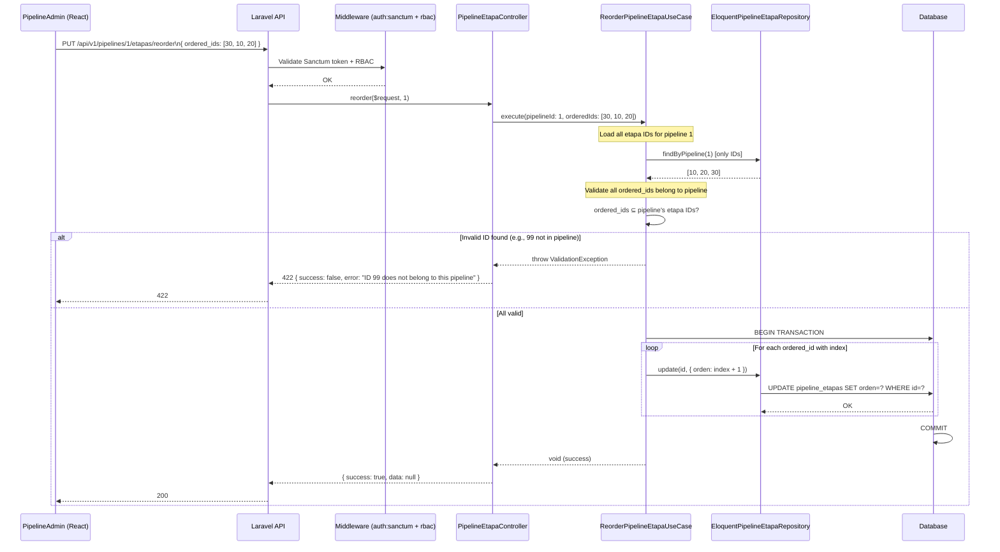

# Design: Pipelines CRUD + Webhook

## Architecture Overview

```
┌─────────────────────────────────────────────────────────────────────────────┐
│                           HTTP Layer (Laravel)                              │
│                                                                             │
│  ┌──────────────────────────────────────────────────────────────────────┐  │
│  │                     Routes (api.php + Module routes)                  │  │
│  │  GET/POST/PUT/DELETE /api/v1/pipelines/*                             │  │
│  │  GET/POST/PUT/DELETE /api/v1/pipelines/{pipeline}/etapas/*           │  │
│  │  POST /api/v1/oportunidades/bulk-move-pipeline                       │  │
│  └──────────────┬───────────────────────────────────────────────────────┘  │
│                 │                                                          │
│                 ▼                                                          │
│  ┌──────────────────────────────────────────────────────────────────────┐  │
│  │                Middleware: auth:sanctum + rbac + throttle              │  │
│  └──────────────┬───────────────────────────────────────────────────────┘  │
│                 │                                                          │
│                 ▼                                                          │
│  ┌──────────────────────────────────────────────────────────────────────┐  │
│  │          Controllers (Modules/CRM/app/Http/Controllers/)              │  │
│  │  PipelineController  PipelineEtapaController  BulkMoveOportunidadesController │
│  │  (move+refactor)    (new)                   (new)                     │  │
│  └──────────────┬───────────────────────────────────────────────────────┘  │
│                 │ delegates to UseCases                                    │
│                 ▼                                                          │
│  ┌──────────────────────────────────────────────────────────────────────┐  │
│  │       UseCases (App\Application\UseCases\Pipeline\ | PipelineEtapa\ | Oportunidad\)     │
│  │  Index/Store/Show/Update/DestroyPipelineUseCase                       │  │
│  │  Index/Store/Show/Update/Destroy/ReorderEtapaUseCase                 │  │
│  │  BulkMoveOportunidadesToPipelineUseCase                               │  │
│  └──────────────┬───────────────────────────────────────────────────────┘  │
│                 │ calls repository interface                               │
│                 ▼                                                          │
│  ┌──────────────────────────────────────────────────────────────────────┐  │
│  │       Repository Interfaces (App\Domain\Repositories\)                │  │
│  │  PipelineRepositoryInterface  PipelineEtapaRepositoryInterface        │  │
│  └──────────────┬───────────────────────────────────────────────────────┘  │
│                 │ injected via AppServiceProvider                          │
│                 ▼                                                          │
│  ┌──────────────────────────────────────────────────────────────────────┐  │
│  │       Eloquent Repos (App\Infrastructure\Persistence\)                │  │
│  │  EloquentPipelineRepository  EloquentPipelineEtapaRepository          │  │
│  │  (extend BaseRepository, map to Domain entities)                      │  │
│  └──────────────┬───────────────────────────────────────────────────────┘  │
│                 │ Eloquent ORM                                             │
│                 ▼                                                          │
│  ┌──────────────────────────────────────────────────────────────────────┐  │
│  │                    SQLite / MariaDB                                    │  │
│  │  pipelines ──1:N── pipeline_etapas ──1:N── oportunidad                │  │
│  └──────────────────────────────────────────────────────────────────────┘  │
│                                                                             │
│  ┌──────────────────────────────────────────────────────────────────────┐  │
│  │  Event Flow:                                                         │  │
│  │                                                                      │  │
│  │  OportunidadObserver::updated()                                      │  │
│  │    └─ isDirty('pipeline_etapa_id')?                                  │  │
│  │       └─ dispatches PipelineEtapaChanged                             │  │
│  │          └─ SendPipelineWebhookListener::handle()                    │  │
│  │             └─ DispatchOutboundWebhookJob::dispatch()                │  │
│  │                └─ QUEUE (database/sync) → CrmWebhookSender           │  │
│  │                   └─ HTTP POST to N8N_PIPELINE_WEBHOOK_URL           │  │
│  │                      with HMAC-SHA256 signature                      │  │
│  └──────────────────────────────────────────────────────────────────────┘  │
└─────────────────────────────────────────────────────────────────────────────┘
```

### Layer Responsibilities

| Layer | Responsibility | Location |
|-------|---------------|----------|
| **Controllers** | HTTP concerns only: parse request, delegate to UseCase, return JSON | `Modules/CRM/app/Http/Controllers/` |
| **Form Requests** | Input validation + authorization gates | `app/Http/Requests/` |
| **API Resources** | Response shaping (JSON transforms) | `app/Http/Resources/` |
| **UseCases** | Business logic orchestration, no HTTP/DB knowledge | `app/Application/UseCases/` |
| **Repository Interfaces** | Contracts for data access | `app/Domain/Repositories/` |
| **Domain Entities** | Pure PHP objects, no framework deps | `app/Domain/Entities/` |
| **Eloquent Repositories** | ORM implementation of contracts | `app/Infrastructure/Persistence/` |
| **Events** | Domain event classes | `app/Events/` |
| **Listeners** | Handle events, dispatch jobs | `app/Infrastructure/Webhook/Listeners/` |
| **Jobs** | Queued outbound HTTP calls | `app/Infrastructure/Webhook/` |
| **Models** | Eloquent models | `Modules/CRM/app/Models/` |
| **Observers** | Model lifecycle hooks | `app/Observers/` |

---

## Component Map

### Backend (Laravel)

```
app/
├── Application/
│   └── UseCases/
│       ├── Pipeline/
│       │   ├── IndexPipelineUseCase.php          (new)
│       │   ├── ShowPipelineUseCase.php           (new)
│       │   ├── StorePipelineUseCase.php          (new)
│       │   ├── UpdatePipelineUseCase.php         (new)
│       │   └── DestroyPipelineUseCase.php        (new)
│       ├── PipelineEtapa/
│       │   ├── IndexPipelineEtapaUseCase.php     (new)
│       │   ├── ShowPipelineEtapaUseCase.php      (new)
│       │   ├── StorePipelineEtapaUseCase.php     (new)
│       │   ├── UpdatePipelineEtapaUseCase.php    (new)
│       │   ├── DestroyPipelineEtapaUseCase.php   (new)
│       │   └── ReorderPipelineEtapaUseCase.php   (new)
│       └── Oportunidad/
│           └── BulkMoveOportunidadesToPipelineUseCase.php  (new)
├── Domain/
│   ├── Repositories/
│   │   ├── PipelineRepositoryInterface.php       (new)
│   │   └── PipelineEtapaRepositoryInterface.php  (new)
│   └── Entities/
│       ├── Pipeline.php                          (new domain entity)
│       └── PipelineEtapa.php                     (new domain entity)
├── Infrastructure/
│   ├── Persistence/
│   │   ├── EloquentPipelineRepository.php        (new)
│   │   └── EloquentPipelineEtapaRepository.php   (new)
│   └── Webhook/
│       ├── CrmWebhookSender.php                  (modified: $configPrefix param)
│       ├── DispatchOutboundWebhookJob.php        (modified: $configPrefix param)
│       └── Listeners/
│           └── SendPipelineWebhookListener.php   (new)
├── Events/
│   └── PipelineEtapaChanged.php                  (new)
├── Http/
│   ├── Requests/
│   │   ├── StorePipelineRequest.php              (new)
│   │   ├── UpdatePipelineRequest.php             (new)
│   │   ├── StorePipelineEtapaRequest.php         (new)
│   │   ├── UpdatePipelineEtapaRequest.php        (new)
│   │   ├── ReorderPipelineEtapaRequest.php       (new)
│   │   └── BulkMoveOportunidadesRequest.php      (new)
│   └── Resources/
│       ├── PipelineResource.php                  (new)
│       └── PipelineEtapaResource.php             (new)
├── Providers/
│   ├── AppServiceProvider.php                    (modified: 2 new bindings)
│   └── EventServiceProvider.php                  (modified: event→listener mapping)
└── Observers/
    └── OportunidadObserver.php                   (modified: dispatch event)

Modules/CRM/
├── app/
│   ├── Http/Controllers/
│   │   ├── PipelineController.php               (moved from app/, refactored + extended)
│   │   ├── PipelineEtapaController.php           (new)
│   │   └── BulkMoveOportunidadesController.php   (new)
│   └── Models/
│       ├── Pipeline.php                          (modified: add HasFactory)
│       ├── PipelineEtapa.php                     (modified: add HasFactory)
│       └── Oportunidad.php                       (unchanged)
├── routes/
│   └── api.php                                   (modified: 12 new routes)

config/
└── webhook.php                                   (modified: add pipeline section)

database/
├── migrations/
│   └── 2026_06_07_000000_assign_pipeline_etapa_to_existing_oportunidades.php  (new — if needed; existing migration may suffice)
├── factories/
│   ├── PipelineFactory.php                       (new)
│   └── PipelineEtapaFactory.php                  (new)
└── seeders/
    └── PipelineSeeder.php                        (modified: Cotización + Recuperación)

routes/
└── api.php                                       (modified: remove GET /pipelines, line 214)

tests/
├── Feature/
│   ├── API/
│   │   ├── PipelineControllerTest.php            (new)
│   │   ├── PipelineEtapaControllerTest.php       (new)
│   │   └── BulkMoveOportunidadesTest.php         (new)
│   └── Events/
│       └── PipelineEtapaChangedEventTest.php     (new)
└── Unit/
    └── Domain/
        ├── PipelineTest.php                      (new)
        └── PipelineEtapaTest.php                 (new)
```

### Frontend (dashboard-crm)

```
dashboard-crm/src/
├── pages/
│   ├── CRMLayout.tsx             (new — <Outlet /> parent for all /crm/*)
│   ├── PipelineAdmin.tsx         (new — table/cards, expandable etapas, up/down reorder)
│   └── CRMPage.tsx               (modified — move to /crm/oportunidad, bulk action bar, drag uses pipeline_etapa_id)
├── api/
│   ├── types.ts                  (modified — add Pipeline, PipelineEtapa interfaces)
│   └── crmApi.ts                 (modified — add CRUD functions + bulkMove)
└── App.tsx / router config       (modified — nested routes under /crm/ with CRMLayout)
```

---

## Key Technical Decisions

### 1. Controller Placement — Modular Monolith Cohesion

**Decision**: Move `PipelineController` from `app/Http/Controllers/API/` to `Modules/CRM/app/Http/Controllers/`. All new pipeline/etapa controllers live in the module. All pipeline routes go in `Modules/CRM/routes/api.php`.

**Rationale**: The models (`Pipeline`, `PipelineEtapa`) already live in `Modules/CRM/app/Models/`. Moving controllers to the module enforces modular monolith cohesion — when a model is in a module, its controllers and routes should be too. This is a gradual refactor: the `routes/api.php` has commented-out blocks for contact routes that were moved similarly.

**Impact**: Namespace change from `App\Http\Controllers\API` to `Modules\CRM\Http\Controllers`. The existing `GET /api/v1/pipelines` route at line 214 of `routes/api.php` is removed and re-registered in the module. URL stays the same — no breaking changes.

### 2. Clean Architecture Layers with Minimal Domain Entities

**Decision**: Create repository interfaces (`PipelineRepositoryInterface`, `PipelineEtapaRepositoryInterface`) and Eloquent implementations. UseCases orchestrate business logic and call repositories. Domain entities (`App\Domain\Entities\Pipeline`, `PipelineEtapa`) are pure PHP classes.

**Rationale**: Follows the existing pattern established by `OportunidadRepositoryInterface` / `EloquentOportunidadRepository`. However, for pipelines and etapas (which are simple read/write models without complex domain logic), the UseCase → Repository → Eloquent → DB chain may seem overengineered, but maintaining architectural consistency across the codebase is more important than optimizing for simplicity. All existing CRUD entities follow this pattern.

**Trade-off acknowledged**: Domain entities for Pipeline/PipelineEtapa are thin wrappers. If the team finds them unnecessary, they can be removed, but consistency is preferred for now.

**Repository method signatures**:

```php
interface PipelineRepositoryInterface {
    public function find(int $id): ?Pipeline;                   // returns domain entity or null
    public function findAll(array $filters = []): array;        // returns array of domain entities
    public function create(array $data): Pipeline;              // returns domain entity
    public function update(int $id, array $data): Pipeline;     // returns domain entity
    public function delete(int $id): bool;
    public function findWithEtapas(int $id): ?Pipeline;         // eager loads etapas ordered
}

interface PipelineEtapaRepositoryInterface {
    public function find(int $id): ?PipelineEtapa;
    public function findByPipeline(int $pipelineId): array;
    public function create(int $pipelineId, array $data): PipelineEtapa;
    public function update(int $id, array $data): PipelineEtapa;
    public function delete(int $id): bool;
    public function reorder(int $pipelineId, array $orderedIds): void;
}
```

### 3. Database Schema — No New Tables

**Decision**: No new tables. The existing `pipelines` and `pipeline_etapas` tables (created by migration `2026_06_04_124355`) already have the required schema. The `oportunidad` table already has `pipeline_id` and `pipeline_etapa_id` foreign keys.

**What changes**: A one-time data migration (`assign_pipeline_etapa_to_existing_oportunidades.php`) backfills `pipeline_id` and `pipeline_etapa_id` for records where they are still `NULL`, matching legacy `estado` string values against `pipeline_etapas.nombre` in the **Cotización** pipeline.

**Existing migration**: `2026_06_04_192500_migrate_existing_opportunities_to_pipelines_and_stages.php` already migrated records to the default "Llegada" pipeline. The new migration targets records that were NOT covered (e.g., those created between migrations) or that need to be mapped to the new Cotización pipeline.

**Schema reference** (existing):

```sql
CREATE TABLE pipelines (
    id BIGINT UNSIGNED AUTO_INCREMENT PRIMARY KEY,
    nombre VARCHAR(100) NOT NULL,
    codigo VARCHAR(50) NOT NULL UNIQUE,
    habilitado TINYINT(1) DEFAULT 1,
    created_at TIMESTAMP NULL,
    updated_at TIMESTAMP NULL
);

CREATE TABLE pipeline_etapas (
    id BIGINT UNSIGNED AUTO_INCREMENT PRIMARY KEY,
    pipeline_id BIGINT UNSIGNED NOT NULL,
    nombre VARCHAR(100) NOT NULL,
    orden INT DEFAULT 0,
    habilitado TINYINT(1) DEFAULT 1,
    created_at TIMESTAMP NULL,
    updated_at TIMESTAMP NULL,
    FOREIGN KEY (pipeline_id) REFERENCES pipelines(id) ON DELETE CASCADE
);

-- Column on oportunidad (existing):
-- pipeline_id BIGINT UNSIGNED NULL, FK → pipelines(id) ON DELETE SET NULL
-- pipeline_etapa_id BIGINT UNSIGNED NULL, FK → pipeline_etapas(id) ON DELETE SET NULL
```

### 4. Reorder Algorithm

**Decision**: The `PUT /api/v1/pipelines/{pipeline}/etapas/reorder` endpoint accepts `{ ordered_ids: [3, 1, 2] }`. The backend validates all IDs belong to the specified pipeline, then updates `orden = index + 1` for each ID in a single DB transaction.

**Algorithm**:
1. Validate request: `ordered_ids` is required array of integers, min 1 element, each must `exists:pipeline_etapas,id`
2. Load all etapas for the pipeline in one query: `SELECT id FROM pipeline_etapas WHERE pipeline_id = ?`
3. Check every ID in `ordered_ids` belongs to this pipeline — if any doesn't, return 422 with the offending IDs
4. `DB::transaction()`:
   - Iterate `ordered_ids` with index, set `orden = index + 1`
   - Use single `updateOrFail` per ID or batch with `upsert`
5. Return success

**Why not `updateOrFail` in a loop?** For a small number of etapas (< 20), individual updates are fine. For larger sets, a single `upsert` with a case statement is cleaner but adds complexity. Start with individual updates in the transaction — perf is not a concern for this data volume.

### 5. Bulk Move Transaction Strategy

**Decision**: The `POST /api/v1/oportunidades/bulk-move-pipeline` endpoint wraps the entire operation in a `DB::transaction`. Each oportunidad that moves fires its own `PipelineEtapaChanged` event individually.

**Flow**:
1. Validate request: all `oportunidad_ids` must exist and belong to the current user's organization
2. Validate target: `target_pipeline_etapa_id` belongs to `target_pipeline_id` and is enabled
3. `DB::transaction()`:
   - For each oportunidad ID:
     - Load the oportunidad
     - Get old `pipeline_etapa_id`
     - Update `pipeline_etapa_id` to target
     - Dispatch `PipelineEtapaChanged` event (but don't queue yet — events are fired synchronously within transaction)
   - If any fails, throw exception → rollback
4. After transaction commits, queued jobs fire asynchronously

**Why fire individual events instead of one bulk event?** n8n needs one webhook per oportunidad for granular Mailrelay sequence tracking. For a batch of 50+ oportunidades, this means 50+ webhook calls. The queue handles the load — the transaction commits quickly, and the queue worker processes them async.

**Failed ID reporting**: If validation fails, return 422 with `{ error: "IDs not found: [999]", invalid_ids: [999] }`. No partial updates occur because of the transaction.

### 6. Event System — Observer-Based Dispatch

**Decision**: `PipelineEtapaChanged` is dispatched from `OportunidadObserver::updated()`, NOT from controllers or UseCases.

**Why**: The observer is already registered globally and already has `isDirty('pipeline_etapa_id')` detection. Dispatching from the observer ensures the event fires regardless of HOW the Oportunidad is saved (API, console command, webhook, import, seeder). If we dispatched from controllers only, a future console command or import would silently skip the event.

**Event class**:
```php
class PipelineEtapaChanged {
    public function __construct(
        public Oportunidad $oportunidad,
        public ?PipelineEtapa $oldEtapa,
        public PipelineEtapa $newEtapa,
    ) {}
}
```

**Observer modification** (exact placement in `updated()`):
```php
// Existing isDirty check already exists
if ($oportunidad->isDirty('pipeline_etapa_id')) {
    // Existing cliente_desde logic stays unchanged
    // ... existing code ...

    // NEW: dispatch event
    $oldEtapa = PipelineEtapa::find($oportunidad->getOriginal('pipeline_etapa_id'));
    $newEtapa = PipelineEtapa::find($oportunidad->pipeline_etapa_id);

    if ($newEtapa) { // Only dispatch if we have a new etapa
        PipelineEtapaChanged::dispatch($oportunidad, $oldEtapa, $newEtapa);
    }
}
```

**Guard against null `$newEtapa`**: If `pipeline_etapa_id` is being set to null (edge case), we should NOT fire the event. The check `$newEtapa !== null` prevents this.

### 7. Webhook Architecture — Config Prefix on Existing Sender

**Decision**: Extend `CrmWebhookSender::send()` with an optional 3rd parameter `string $configPrefix = 'outbound'`. When `'pipeline'` is passed, it reads `config('webhook.pipeline.url')` and `config('webhook.pipeline.secret')` instead of `config('webhook.outbound.*')`.

**Rationale**: The pipeline webhook goes to a different URL (`N8N_PIPELINE_WEBHOOK_URL`) than the existing outbound webhook (`WEBHOOK_OUTBOUND_URL`). However, it uses the same signing (HMAC-SHA256), timeout, and error handling logic. Adding a config prefix avoids duplicating the entire sender class. If the payload format diverges significantly in the future, a dedicated sender can be created at that point.

**Changes to `CrmWebhookSender`**:
```php
public function send(string $event, array $data, string $configPrefix = 'outbound'): void
{
    $payload = [
        'event' => $event,
        'timestamp' => now()->toIso8601String(),
        'data' => $data,
    ];

    $body = json_encode($payload);
    $config = config("webhook.{$configPrefix}");
    $secret = $config['secret'] ?? '';
    $signature = 'sha256=' . hash_hmac('sha256', $body, $secret);
    $url = $config['url'] ?? '';

    // ... rest stays the same, but guard on empty url
}
```

**Changes to `DispatchOutboundWebhookJob`**:
```php
public function __construct(
    public string $event,
    public array $data,
    public string $configPrefix = 'outbound',
) {
    $this->queue = 'webhooks';
}

public function handle(CrmWebhookSender $sender): void
{
    $sender->send($this->event, $this->data, $this->configPrefix);
}
```

**Config addition** in `config/webhook.php`:
```php
'pipeline' => [
    'url' => env('N8N_PIPELINE_WEBHOOK_URL', ''),
    'secret' => env('N8N_PIPELINE_WEBHOOK_SECRET', ''),
],
```

**Graceful disable**: When `N8N_PIPELINE_WEBHOOK_URL` is empty/null, the sender logs a debug message and returns early without making an HTTP call. No error thrown.

### 8. Frontend Routing — Nested under /crm/ with CRMLayout

**Decision**: All CRM pages move under `/crm/*` with a shared `CRMLayout` component (sidebar + `<Outlet />`). The current `/crm` route moves to `/crm/oportunidad`.

**Route structure in `App.tsx`**:
```tsx
<Route path="/crm" element={<CRMLayout />}>
  <Route index element={<Navigate to="/crm/oportunidad" replace />} />
  <Route path="dashboard" element={<DashboardPage />} />
  <Route path="pipelines" element={<PipelineAdmin />} />
  <Route path="oportunidad" element={<CRMPage />} />
  <Route path="contactos" element={<ContactosPage />} />
  <Route path="entidad" element={<EntidadPage />} />
</Route>
```

**PipelineAdmin sub-routes**: All handled as UI state within the component (show/edit/delete modals and expandable sections), not as separate routes. No need for `/crm/pipelines/:id/edit` as separate route paths since the admin is a single-page management tool.

**Kanban drag fix**: `CRMPage.tsx` already uses `@dnd-kit`. The `onDragEnd` handler currently sends `{ estado: string }`. This changes to send `{ pipeline_etapa_id: number }`. Both fields can be sent during transition: `{ pipeline_etapa_id, estado }` for backward compatibility.

### 9. Testing Strategy — Strict TDD

**Decision**: Every feature requires tests FIRST. UseCases get Unit tests, Controllers get Feature tests with `RefreshDatabase` + Sanctum tokens, Events get fired-when-expected tests.

**Test file structure**:
| Test Class | Type | What it covers |
|---|---|---|
| `PipelineControllerTest` | Feature | 5 CRUD endpoints + auth + validation + RBAC |
| `PipelineEtapaControllerTest` | Feature | 6 endpoints (incl. reorder) + cross-pipeline validation |
| `BulkMoveOportunidadesTest` | Feature | Happy path, partial failure, transaction rollback, event firing |
| `PipelineEtapaChangedEventTest` | Feature | Observer fires event, listener dispatches webhook job |
| `PipelineTest` | Unit | Factory creation, relationships |
| `PipelineEtapaTest` | Unit | Factory creation, relationship to pipeline, orden defaults |

**Canonical test pattern** (from existing `OportunidadControllerTest.php`):
1. `use RefreshDatabase;`
2. `setUp()` calls `$this->seed(PipelineSeeder::class)`
3. `authenticate()` helper creates a Rol with wildcard `*` permission, creates Usuario, creates Sanctum token
4. Each test method uses `#[Test]` attribute (PHPUnit 11)
5. Assertions: `assertStatus`, `assertJsonPath('success', true)`, `assertJsonStructure`

**TDD cycle per UseCase**:
1. Write test method with expected input/output
2. Run test → red (class/method doesn't exist)
3. Create class + method with minimal implementation
4. Run test → green
5. Refactor

---

## Data Flow

### Bulk Move Flow

```mermaid
sequenceDiagram
    participant Frontend as React Frontend
    participant API as Laravel API
    participant MW as Middleware (auth:sanctum + rbac)
    participant Ctrl as BulkMoveOportunidadesController
    param UseCase UseCase
    participant Repo as EloquentOportunidadRepository
    participant DB as Database
    participant Obv as OportunidadObserver
    participant Evt as PipelineEtapaChanged Event
    participant Listener as SendPipelineWebhookListener
    participant Queue as Job Queue
    participant Webhook as CrmWebhookSender → n8n

    Frontend->>API: POST /api/v1/oportunidades/bulk-move-pipeline\n{ oportunidad_ids: [1,2,3], target_pipeline_etapa_id: 5 }
    API->>MW: Validate Sanctum token + RBAC permission
    MW-->>API: Authenticated + Authorized
    API->>Ctrl: bulkMove($request)
    Ctrl->>UseCase: execute($request->validated())

    Note over UseCase: Validate all IDs exist\nand belong to user's org

    UseCase->>DB: BEGIN TRANSACTION
    loop For each oportunidad_id
        UseCase->>Repo: findById(id)
        Repo-->>UseCase: Oportunidad
        UseCase->>Repo: update(id, { pipeline_etapa_id: 5 })
        Repo->>DB: UPDATE oportunidad SET pipeline_etapa_id=5 WHERE id=?
        DB-->>Repo: Row updated
        Repo-->>UseCase: Updated Oportunidad

        Note over Obv: Observer fires on model save
        Obv->>Evt: Dispatch PipelineEtapaChanged(oportunidad, oldEtapa, newEtapa)
        Evt->>Listener: handle(event)
        Listener->>Queue: Dispatch DispatchOutboundWebhookJob('pipeline.etapa.changed', {...}, 'pipeline')
    end
    UseCase-->>Ctrl: { moved_count: 3, ids: [1,2,3] }
    DB-->>UseCase: COMMIT

    Queue-->>Webhook: Process job asynchronously
    Webhook->>Webhook: Build payload + HMAC-SHA256 signature
    Webhook->>n8n: HTTP POST to N8N_PIPELINE_WEBHOOK_URL\nX-Webhook-Signature: sha256=...
    n8n-->>Webhook: 200 OK

    Ctrl-->>API: { success: true, data: { moved_count: 3, oportunidad_ids: [1,2,3] } }
    API-->>Frontend: 200 JSON response
```

### Reorder Flow



---

## API Contract

### Endpoints

All endpoints are prefixed with `/api/v1`.

#### Pipeline CRUD

| Method | URL | Permission | Auth | Request Body | Response | Status |
|--------|-----|-----------|------|-------------|----------|--------|
| GET | `/pipelines` | `pipelines.index` | Sanctum + RBAC | — | `{ success, data: Pipeline[] }` | 200 |
| POST | `/pipelines` | `pipelines.store` | Sanctum + RBAC | `{ nombre, codigo, habilitado? }` | `{ success, data: Pipeline }` | 201 |
| GET | `/pipelines/{id}` | `pipelines.show` | Sanctum + RBAC | — | `{ success, data: Pipeline }` | 200 |
| PUT | `/pipelines/{id}` | `pipelines.update` | Sanctum + RBAC | `{ nombre?, codigo?, habilitado? }` | `{ success, data: Pipeline }` | 200 |
| DELETE | `/pipelines/{id}` | `pipelines.destroy` | Sanctum + RBAC | — | `{ success, data: null }` | 200 |

#### Pipeline Etapa CRUD

| Method | URL | Permission | Auth | Request Body | Response | Status |
|--------|-----|-----------|------|-------------|----------|--------|
| GET | `/pipelines/{pipeline}/etapas` | `pipeline-etapas.index` | Sanctum + RBAC | — | `{ success, data: PipelineEtapa[] }` | 200 |
| POST | `/pipelines/{pipeline}/etapas` | `pipeline-etapas.store` | Sanctum + RBAC | `{ nombre, orden?, habilitado? }` | `{ success, data: PipelineEtapa }` | 201 |
| GET | `/pipelines/etapas/{id}` | `pipeline-etapas.show` | Sanctum + RBAC | — | `{ success, data: PipelineEtapa }` | 200 |
| PUT | `/pipelines/etapas/{id}` | `pipeline-etapas.update` | Sanctum + RBAC | `{ nombre?, orden?, habilitado? }` | `{ success, data: PipelineEtapa }` | 200 |
| DELETE | `/pipelines/etapas/{id}` | `pipeline-etapas.destroy` | Sanctum + RBAC | — | `{ success, data: null }` | 200 |
| PUT | `/pipelines/{pipeline}/etapas/reorder` | `pipeline-etapas.update` | Sanctum + RBAC | `{ ordered_ids: number[] }` | `{ success, data: null }` | 200 |

#### Bulk Move

| Method | URL | Permission | Auth | Request Body | Response | Status |
|--------|-----|-----------|------|-------------|----------|--------|
| POST | `/oportunidades/bulk-move-pipeline` | `oportunidades.bulk-move` | Sanctum + RBAC | `{ oportunidad_ids: number[], target_pipeline_etapa_id: number }` | `{ success, data: { moved_count, oportunidad_ids } }` | 200 |

### Resource Shapes

**PipelineResource**:
```json
{
  "id": 1,
  "nombre": "Cotización",
  "codigo": "COTIZACION",
  "habilitado": true,
  "etapas": [
    { "id": 1, "pipeline_id": 1, "nombre": "Borrador", "orden": 1, "habilitado": true, "created_at": "...", "updated_at": "..." },
    { "id": 2, "pipeline_id": 1, "nombre": "Enviado", "orden": 2, "habilitado": true, "created_at": "...", "updated_at": "..." }
  ],
  "created_at": "2026-06-07T00:00:00.000000Z",
  "updated_at": "2026-06-07T00:00:00.000000Z"
}
```

**PipelineEtapaResource**:
```json
{
  "id": 1,
  "pipeline_id": 1,
  "nombre": "Borrador",
  "orden": 1,
  "habilitado": true,
  "created_at": "2026-06-07T00:00:00.000000Z",
  "updated_at": "2026-06-07T00:00:00.000000Z"
}
```

### Validation Rules

| Request Class | Rules |
|---|---|
| `StorePipelineRequest` | `nombre`: required, string, max:100. `codigo`: required, string, max:50, unique:pipelines. `habilitado`: boolean, optional |
| `UpdatePipelineRequest` | Same as store but `codigo` unique ignores current ID: `unique:pipelines,codigo,{id}` |
| `StorePipelineEtapaRequest` | `nombre`: required, string, max:100. `orden`: integer, min:0, optional. `habilitado`: boolean, optional |
| `UpdatePipelineEtapaRequest` | Same as store |
| `ReorderPipelineEtapaRequest` | `ordered_ids`: required, array, min:1. `ordered_ids.*`: integer, exists:pipeline_etapas,id |
| `BulkMoveOportunidadesRequest` | `oportunidad_ids`: required, array, min:1. `oportunidad_ids.*`: integer, exists:oportunidad,id. `target_pipeline_etapa_id`: required, integer, exists:pipeline_etapas,id |

---

## Database Schema

No new tables. The existing schema from migration `2026_06_04_124355` is sufficient.

### New Column on `oportunidad`

No new columns needed — `pipeline_id` and `pipeline_etapa_id` already exist.

### Existing Schema (unchanged)

```sql
-- pipelines table (already exists)
CREATE TABLE pipelines (
    id          BIGINT UNSIGNED AUTO_INCREMENT PRIMARY KEY,
    nombre      VARCHAR(100) NOT NULL,
    codigo      VARCHAR(50) NOT NULL UNIQUE,
    habilitado  TINYINT(1) DEFAULT 1,
    created_at  TIMESTAMP NULL,
    updated_at  TIMESTAMP NULL
);

-- pipeline_etapas table (already exists)
CREATE TABLE pipeline_etapas (
    id          BIGINT UNSIGNED AUTO_INCREMENT PRIMARY KEY,
    pipeline_id BIGINT UNSIGNED NOT NULL,
    nombre      VARCHAR(100) NOT NULL,
    orden       INT DEFAULT 0,
    habilitado  TINYINT(1) DEFAULT 1,
    created_at  TIMESTAMP NULL,
    updated_at  TIMESTAMP NULL,
    FOREIGN KEY (pipeline_id) REFERENCES pipelines(id) ON DELETE CASCADE
);

-- oportunidad table — existing FK columns (already migrated)
ALTER TABLE oportunidad ADD COLUMN pipeline_id       BIGINT UNSIGNED NULL AFTER contacto_id;
ALTER TABLE oportunidad ADD COLUMN pipeline_etapa_id BIGINT UNSIGNED NULL AFTER pipeline_id;

ALTER TABLE oportunidad ADD CONSTRAINT fk_oportunidad_pipeline
    FOREIGN KEY (pipeline_id) REFERENCES pipelines(id) ON DELETE SET NULL;
ALTER TABLE oportunidad ADD CONSTRAINT fk_oportunidad_pipeline_etapa
    FOREIGN KEY (pipeline_etapa_id) REFERENCES pipeline_etapas(id) ON DELETE SET NULL;
```

### Indexes

Existing indexes are sufficient. No new indexes needed since:
- `pipelines.codigo` already has `UNIQUE` index
- `pipeline_etapas.pipeline_id` has FK index (MariaDB auto-indexes FKs)
- `oportunidad.pipeline_etapa_id` has FK index

---

## Error Handling

### Standardized Envelope

All responses follow the existing `ApiResponse` trait format:

**Success**:
```json
{
  "success": true,
  "data": { ... },
  "message": "Optional message"  // only when meaningful
}
```

**Validation Error** (422):
```json
{
  "success": false,
  "error": "El campo codigo ya ha sido registrado.",
  "errors": {
    "codigo": ["El campo codigo ya ha sido registrado."]
  }
}
```

**Authorization Error** (403):
```json
{
  "success": false,
  "error": "No tienes permiso para realizar esta acción."
}
```

**Authentication Error** (401):
```json
{
  "success": false,
  "error": "Token de autenticación no proporcionado o inválido."
}
```

**Not Found** (404):
```json
{
  "success": false,
  "error": "Pipeline no encontrado."
}
```

**Cross-Pipeline Validation** (422 — reorder):
```json
{
  "success": false,
  "error": "Las siguientes etapas no pertenecen a este pipeline: [30]",
  "invalid_ids": [30]
}
```

**Bulk Move Partial Validation** (422):
```json
{
  "success": false,
  "error": "IDs no encontrados: [999]",
  "invalid_ids": [999]
}
```

### Error Handling in UseCases

- **NotFoundException**: thrown when `find()` or `findById()` returns null — UseCase throws a domain exception, caught by controller's exception handler
- **ValidationException**: thrown by FormRequest automatically — UseCases do NOT re-validate what the request already validated
- **AuthorizationException**: thrown by `Gate::authorize()` or middleware — handled at the controller/routing layer, never in UseCases

---

## Security

### Authentication

All new endpoints require `auth:sanctum` middleware. The existing `throttle-mutations` rate limiter applies to POST/PUT/DELETE.

### Authorization (RBAC)

Permission strings match route names. Middleware `rbac` checks `Permiso` table:

| Permission | Routes Protected |
|---|---|
| `pipelines.index` | `GET /pipelines` |
| `pipelines.store` | `POST /pipelines` |
| `pipelines.show` | `GET /pipelines/{id}` |
| `pipelines.update` | `PUT /pipelines/{id}` |
| `pipelines.destroy` | `DELETE /pipelines/{id}` |
| `pipeline-etapas.index` | `GET /pipelines/{pipeline}/etapas` |
| `pipeline-etapas.store` | `POST /pipelines/{pipeline}/etapas` |
| `pipeline-etapas.show` | `GET /pipelines/etapas/{id}` |
| `pipeline-etapas.update` | `PUT /pipelines/etapas/{id}` + `PUT /pipelines/{pipeline}/etapas/reorder` |
| `pipeline-etapas.destroy` | `DELETE /pipelines/etapas/{id}` |
| `oportunidades.bulk-move` | `POST /oportunidades/bulk-move-pipeline` |

**Wildcard behavior**: SuperAdmin/Admin roles with `vista: '*'` bypass all permission checks (existing behavior in `rbac` middleware).

**PermisoSeeder update**:
```php
'pipelines' => ['index', 'store', 'show', 'update', 'destroy'],
'pipeline-etapas' => ['index', 'store', 'show', 'update', 'destroy'],
'oportunidades' => [/* existing */, 'bulk-move'],  // add 'bulk-move'
```

### Webhook Security (HMAC-SHA256)

The outbound webhook to n8n is signed with HMAC-SHA256:

```
signature = sha256=hash_hmac('sha256', json_body, N8N_PIPELINE_WEBHOOK_SECRET)
Header: X-Webhook-Signature: sha256=<signature>
```

The n8n endpoint should verify this signature before processing the payload. This ensures the request came from the CRM and wasn't tampered with in transit.

### Idempotency

- **Webhook payload** includes a `dedup_key` field (format: `pipeline.etapa.changed:{oportunidad_id}:{timestamp_epoch}`). n8n should implement dedup based on this key.
- **Pipeline seeder** uses `firstOrCreate` / `updateOrInsert` patterns. Running twice produces no duplicates.
- **Data migration** checks `WHERE pipeline_etapa_id IS NULL` before updating — safe to run multiple times.

---

## Testing Strategy

### Strict TDD Workflow

```
1. Write test (RED)    →  2. Run test (fails)
3. Write code (GREEN)  →  4. Run test (passes)
5. Refactor            →  6. Repeat
```

### Test File Details

#### `PipelineTest` (Unit)
```php
#[Test]
public function it_creates_pipeline_using_factory(): void
{
    $pipeline = PipelineFactory::new()->create();
    $this->assertNotNull($pipeline->id);
    $this->assertNotNull($pipeline->nombre);
    $this->assertNotNull($pipeline->codigo);
}
```

#### `PipelineEtapaTest` (Unit)
```php
#[Test]
public function it_creates_etapa_with_default_orden(): void
{
    $pipeline = PipelineFactory::new()->create();
    $etapa = PipelineEtapaFactory::new()->forPipeline($pipeline)->create();
    $this->assertEquals($pipeline->id, $etapa->pipeline_id);
    $this->assertIsInt($etapa->orden);
}
```

#### `PipelineControllerTest` (Feature)
```php
#[Test]
public function it_lists_pipelines(): void { /* ... */ }

#[Test]
public function it_creates_a_pipeline(): void { /* ... */ }

#[Test]
public function it_shows_a_pipeline_with_etapas(): void { /* ... */ }

#[Test]
public function it_updates_a_pipeline(): void { /* ... */ }

#[Test]
public function it_deletes_a_pipeline_and_cascades_etapas(): void { /* ... */ }

#[Test]
public function it_rejects_duplicate_codigo(): void { /* 422 */ }

#[Test]
public function it_rejects_without_permission(): void { /* 403 */ }
```

#### `PipelineEtapaControllerTest` (Feature)
```php
#[Test]
public function it_lists_etapas_ordered(): void { /* ... */ }

#[Test]
public function it_creates_etapa_with_auto_orden(): void { /* ... */ }

#[Test]
public function it_reorders_etapas(): void { /* ... */ }

#[Test]
public function it_rejects_cross_pipeline_reorder(): void { /* 422 */ }
```

#### `BulkMoveOportunidadesTest` (Feature)
```php
#[Test]
public function it_moves_multiple_oportunidades(): void { /* ... */ }

#[Test]
public function it_rolls_back_on_invalid_id(): void { /* ... */ }

#[Test]
public function it_fires_event_per_oportunidad(): void { /* ... */ }
```

#### `PipelineEtapaChangedEventTest` (Feature)
```php
#[Test]
public function it_dispatches_event_on_etapa_change(): void { /* ... */ }

#[Test]
public function it_does_not_dispatch_on_non_etapa_update(): void { /* ... */ }

#[Test]
public function listener_queues_webhook_job(): void { /* ... */ }
```

### Test Configuration

- **Database**: SQLite `:memory:` (forced in `phpunit.xml`)
- **Trait**: `RefreshDatabase` for all Feature tests
- **Auth**: Create User + Rol with wildcard permission, call `$user->createToken('test-token')->plainTextToken`
- **Factories**: `PipelineFactory`, `PipelineEtapaFactory` in `database/factories/` (or module-specific)
- **Seedings**: `$this->seed(PipelineSeeder::class)` in `setUp()`

### Webhook Job Test Strategy

The `SendPipelineWebhookListener` queues a `DispatchOutboundWebhookJob`. In tests with `QUEUE_CONNECTION=sync` (default for tests), the job runs synchronously. The test can assert:
- The webhook job was dispatched (using `Queue::fake()`)
- The `CrmWebhookSender::send()` was called with correct params (using `Http::fake()`)
- The signature header is present (assert against HTTP mock)

---

## Migration Plan

### Step 1: Run data migration (if needed)

```bash
php artisan migrate
```

The migration `2026_06_07_000000_assign_pipeline_etapa_to_existing_oportunidades.php` will:
1. Find all records where `pipeline_etapa_id IS NULL`
2. Match `estado` string against `pipeline_etapas.nombre` in the **Cotización** pipeline
3. If matched, set `pipeline_id` and `pipeline_etapa_id`
4. If not matched, default to the first etapa (`orden = 1`) of Cotización
5. Skip records that already have `pipeline_etapa_id` (idempotent)

### Step 2: Run pipeline seeder

```bash
php artisan db:seed --class=PipelineSeeder
```

This seeds the **Cotización** and **Recuperación** pipelines with their etapas using idempotent `updateOrInsert` patterns.

### Step 3: Register permissions

```bash
php artisan db:seed --class=PermisoSeeder
```

This adds the new `pipelines.*`, `pipeline-etapas.*`, and `oportunidades.bulk-move` permissions.

### Step 4: Verify

```bash
composer test   # All tests pass
```

### Execution Order

1. Code changes (files created/modified as per component map)
2. `database/migrations/` — run `php artisan migrate`
3. `database/seeders/PipelineSeeder.php` — run `php artisan db:seed --class=PipelineSeeder`
4. `database/seeders/PermisoSeeder.php` — run `php artisan db:seed --class=PermisoSeeder`
5. Run tests: `composer test`
6. Deploy

---

## Rollback Plan

### Database Rollback

```bash
# If data migration was the last migration:
php artisan migrate:rollback --step=1

# Revert seeder changes:
# Run: php artisan db:seed --class=PipelineSeeder
# (Seeder is idempotent — it won't add duplicates.
#  To "undo," manually delete the Cotización and Recuperación pipelines:
#  DELETE FROM pipeline_etapas WHERE pipeline_id IN (SELECT id FROM pipelines WHERE codigo IN ('COTIZACION', 'RECUPERACION'));
#  DELETE FROM pipelines WHERE codigo IN ('COTIZACION', 'RECUPERACION');
)
```

### Code Rollback

**Files to revert** (via `git checkout`):

| File | Action |
|---|---|
| `routes/api.php` | Restore `GET /pipelines` route at line 214 |
| `Modules/CRM/routes/api.php` | Remove 12 new routes |
| `app/Providers/AppServiceProvider.php` | Remove 2 repository bindings |
| `app/Providers/EventServiceProvider.php` | Remove event→listener mapping |
| `app/Observers/OportunidadObserver.php` | Remove dispatch lines |
| `app/Infrastructure/Webhook/CrmWebhookSender.php` | Remove $configPrefix param |
| `app/Infrastructure/Webhook/DispatchOutboundWebhookJob.php` | Remove $configPrefix param |
| `config/webhook.php` | Remove `pipeline` section |
| `database/seeders/PermisoSeeder.php` | Remove `pipelines.*`, `pipeline-etapas.*`, `bulk-move` |
| `Modules/CRM/app/Models/Pipeline.php` | Remove `HasFactory` if added |
| `Modules/CRM/app/Models/PipelineEtapa.php` | Remove `HasFactory` if added |

**Files to delete**:
- `app/Application/UseCases/Pipeline/` (5 files)
- `app/Application/UseCases/PipelineEtapa/` (6 files)
- `app/Application/UseCases/Oportunidad/BulkMoveOportunidadesToPipelineUseCase.php`
- `app/Domain/Repositories/PipelineRepositoryInterface.php`
- `app/Domain/Repositories/PipelineEtapaRepositoryInterface.php`
- `app/Domain/Entities/Pipeline.php`
- `app/Domain/Entities/PipelineEtapa.php`
- `app/Infrastructure/Persistence/EloquentPipelineRepository.php`
- `app/Infrastructure/Persistence/EloquentPipelineEtapaRepository.php`
- `app/Infrastructure/Webhook/Listeners/SendPipelineWebhookListener.php`
- `app/Events/PipelineEtapaChanged.php`
- `app/Http/Requests/StorePipelineRequest.php` through `BulkMoveOportunidadesRequest.php` (6 files)
- `app/Http/Resources/PipelineResource.php`
- `app/Http/Resources/PipelineEtapaResource.php`
- `Modules/CRM/app/Http/Controllers/PipelineController.php` (restore original from `app/Http/Controllers/API/`)
- `Modules/CRM/app/Http/Controllers/PipelineEtapaController.php`
- `Modules/CRM/app/Http/Controllers/BulkMoveOportunidadesController.php`
- `database/factories/PipelineFactory.php`
- `database/factories/PipelineEtapaFactory.php`
- `tests/Feature/API/PipelineControllerTest.php`
- `tests/Feature/API/PipelineEtapaControllerTest.php`
- `tests/Feature/API/BulkMoveOportunidadesTest.php`
- `tests/Feature/Events/PipelineEtapaChangedEventTest.php`
- `tests/Unit/Domain/PipelineTest.php`
- `tests/Unit/Domain/PipelineEtapaTest.php`

**Environment cleanup**: Remove `N8N_PIPELINE_WEBHOOK_URL` and `N8N_PIPELINE_WEBHOOK_SECRET` from `.env`.

---

## Email Draft (Mailrelay Autoresponder)

This is the autoresponder email template that **n8n will send via Mailrelay** when an oportunidad changes pipeline etapa. The CRM is NOT responsible for sending this email — it only fires the `PipelineEtapaChanged` webhook. The actual email content lives in Mailrelay's template library, but we provide the canonical copy here so n8n and Mailrelay teams have a single source of truth.

### Variable Substitution (Mailrelay merge tags)

| Tag | Description | Example |
|-----|-------------|---------|
| `{{nombre}}` | Contact's first name | "María" |
| `{{empresa}}` | Organization name | "Distribuidora El Carmen" |
| `{{pipeline}}` | Current pipeline name | "Cotización" |
| `{{etapa}}` | Current etapa name | "En Negociación" |
| `{{oportunidad_id}}` | Internal opportunity ID | "OP-1234" |
| `{{asesor_nombre}}` | Assigned advisor name | "Carlos Ramírez" |
| `{{asesor_telefono}}` | Advisor phone with country code | "+57 311 555 1234" |
| `{{url_cotizacion}}` | Direct link to quote (when available) | "https://app.tecnoinnsoft.com/cotizacion/abc123" |

### Subject Lines (A/B testing variants)

1. **Default**: `{{nombre}}, avanzamos en tu proceso de SG-SST — {{empresa}}`
2. **Variant B (urgency)**: `Quedan pocos espacios este mes, {{nombre}}`
3. **Variant C (social proof)**: `+200 empresas en Colombia ya avanzaron con nosotros`

### Body Template (HTML + Plain Text)

**Plain text version** (the canonical, mailrelay-compatible version):

```
Hola {{nombre}} 👋

Gracias por tu interés en los servicios de Seguridad y Salud en el Trabajo para {{empresa}}.

Tu solicitud ha avanzado a la etapa "{{etapa}}" dentro de nuestro proceso. Esto significa que estamos cada vez más cerca de acompañarte en el cumplimiento del SG-SST (Decreto 1072 de 2015 y Resolución 0312 de 2019).

🛡️ ¿Por qué es importante avanzar ahora?
• El SG-SST es OBLIGATORIO para todas las empresas en Colombia, sin importar su tamaño.
• Las multas por incumplimiento pueden superar los $500 millones COP.
• Un sistema bien implementado reduce accidentes laborales hasta en un 40%.
• Mejora la productividad y el clima organizacional desde el primer mes.

📋 Próximos pasos
1. Tu asesor asignado, {{asesor_nombre}}, revisará tu caso en las próximas 24 horas.
2. Te contactaremos al {{asesor_telefono}} para agendar una llamada de 15 minutos.
3. Si ya tienes la cotización lista, descárgala aquí: {{url_cotizacion}}

💬 ¿Tienes dudas rápidas?
Responde este correo o escríbenos por WhatsApp: +57 311 555 1234

— Equipo Tecnoinnsoft
"Acompañamos a tu empresa a cumplir el SG-SST sin complicaciones"

—
Si prefieres no recibir más comunicaciones sobre este proceso, responde con la palabra BAJA y te removemos de la lista en 24 horas.
```

**HTML version** (mailrelay uses WYSIWYG editor, this is the source structure):

```html
<!DOCTYPE html>
<html lang="es">
<head>
  <meta charset="UTF-8">
  <meta name="viewport" content="width=device-width, initial-scale=1.0">
  <title>Avanzamos en tu proceso SG-SST</title>
</head>
<body style="font-family: -apple-system, BlinkMacSystemFont, 'Segoe UI', Roboto, sans-serif; background-color: #f8fafc; margin: 0; padding: 24px;">
  <table role="presentation" width="100%" cellpadding="0" cellspacing="0" style="max-width: 600px; margin: 0 auto; background-color: #ffffff; border-radius: 8px; overflow: hidden; box-shadow: 0 1px 3px rgba(0,0,0,0.1);">
    <!-- Header -->
    <tr>
      <td style="background: linear-gradient(135deg, #0f766e 0%, #14b8a6 100%); padding: 32px 24px; text-align: center;">
        <h1 style="color: #ffffff; margin: 0; font-size: 24px; font-weight: 600;">Hola, {{nombre}} 👋</h1>
      </td>
    </tr>
    
    <!-- Greeting -->
    <tr>
      <td style="padding: 32px 24px 16px; color: #1e293b; font-size: 16px; line-height: 1.6;">
        <p>Gracias por tu interés en los servicios de <strong>Seguridad y Salud en el Trabajo</strong> para <strong>{{empresa}}</strong>.</p>
        <p>Tu solicitud ha avanzado a la etapa <strong>"{{etapa}}"</strong> dentro de nuestro proceso.</p>
      </td>
    </tr>
    
    <!-- Why now -->
    <tr>
      <td style="padding: 16px 24px;">
        <h2 style="color: #0f766e; font-size: 18px; margin: 0 0 16px;">🛡️ ¿Por qué es importante avanzar ahora?</h2>
        <ul style="color: #475569; font-size: 15px; line-height: 1.7; padding-left: 20px;">
          <li>El SG-SST es <strong>obligatorio</strong> para todas las empresas en Colombia.</li>
          <li>Las multas por incumplimiento pueden superar los <strong>$500 millones COP</strong>.</li>
          <li>Un sistema bien implementado reduce accidentes laborales hasta en un <strong>40%</strong>.</li>
        </ul>
      </td>
    </tr>
    
    <!-- Next steps -->
    <tr>
      <td style="padding: 16px 24px;">
        <h2 style="color: #0f766e; font-size: 18px; margin: 0 0 16px;">📋 Próximos pasos</h2>
        <ol style="color: #475569; font-size: 15px; line-height: 1.7; padding-left: 20px;">
          <li>Tu asesor <strong>{{asesor_nombre}}</strong> revisará tu caso en 24 horas.</li>
          <li>Te contactaremos al <strong>{{asesor_telefono}}</strong>.</li>
          <li>Si ya tienes la cotización: <a href="{{url_cotizacion}}" style="color: #14b8a6;">descárgala aquí</a></li>
        </ol>
      </td>
    </tr>
    
    <!-- CTA -->
    <tr>
      <td style="padding: 24px; text-align: center;">
        <a href="{{url_cotizacion}}" style="display: inline-block; background-color: #0f766e; color: #ffffff; padding: 14px 32px; text-decoration: none; border-radius: 6px; font-weight: 600;">Ver mi cotización</a>
      </td>
    </tr>
    
    <!-- Footer -->
    <tr>
      <td style="background-color: #f1f5f9; padding: 24px; text-align: center; color: #64748b; font-size: 13px;">
        <p style="margin: 0 0 8px;"><strong>Tecnoinnsoft</strong> — Acompañamos a tu empresa a cumplir el SG-SST sin complicaciones</p>
        <p style="margin: 0;">WhatsApp: +57 311 555 1234 · <a href="mailto:contacto@tecnoinnsoft.com" style="color: #0f766e;">contacto@tecnoinnsoft.com</a></p>
        <p style="margin: 16px 0 0; font-size: 12px;">Si prefieres no recibir más comunicaciones, responde con la palabra BAJA.</p>
      </td>
    </tr>
  </table>
</body>
</html>
```

### Mapping: Etapa → Subject Variant

| Etapa | Subject Variant | Reason |
|-------|----------------|--------|
| Borrador | Default | Welcome / first touch |
| Enviado | Variant C (social proof) | After quote sent, leverage trust |
| En Negociación | Variant B (urgency) | Mid-funnel, create urgency |
| Aprobado | Default (success) | Confirmation tone |
| Rechazado | Default (no aggressive) | Respectful follow-up |

### Send Triggers (n8n flow)

The n8n workflow listens to the `PipelineEtapaChanged` webhook from the CRM and:

1. **Validates** the `pipeline_etapa_id` is in {Cotización, Recuperación} (not internal stages).
2. **Looks up** the contact in Mailrelay by email.
3. **Selects** the subject variant based on etapa (mapping above).
4. **Renders** the template with merge tags.
5. **Sends** via Mailrelay API (`POST /v1/campaigns/{id}/send` or autoresponder trigger).
6. **Logs** send status back to CRM via `POST /api/v1/oportunidades/{id}/email-sent` (optional, future enhancement).

### Why This Draft Lives in the SDD Change

- Single source of truth for copy across CRM, n8n, and Mailrelay teams.
- Future regressions in copy can be caught by reviewing this artifact.
- The merge tag contract MUST match the `PipelineEtapaChanged` event payload fields.

### File Storage Recommendation

Save this email template at: `openspec\changes\pipelines-crud-webhook\email-draft.md` (separate file for easy import into Mailrelay).

---

## Dependencies

- Existing `pipelines` and `pipeline_etapas` tables (already migrated)
- Existing `Pipeline` and `PipelineEtapa` models in `Modules/CRM/app/Models/`
- Existing `OportunidadObserver` (register in `AppServiceProvider`)
- Existing `CrmWebhookSender` + `DispatchOutboundWebhookJob` for queued webhook
- Existing `config/webhook.php` structure
- Existing `PermisoSeeder` pattern
- Existing `EventServiceProvider` pattern
- PHP 8.2, Laravel 12.x, nwidart/laravel-modules
- Queue driver: `database` in dev, `sync` in tests
- Frontend: React Router v6, TanStack Query, `@dnd-kit`
